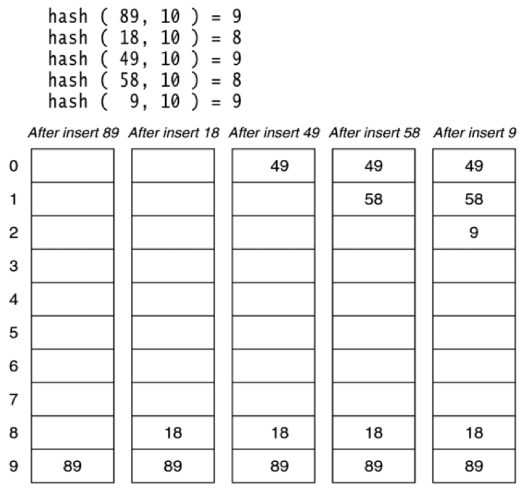
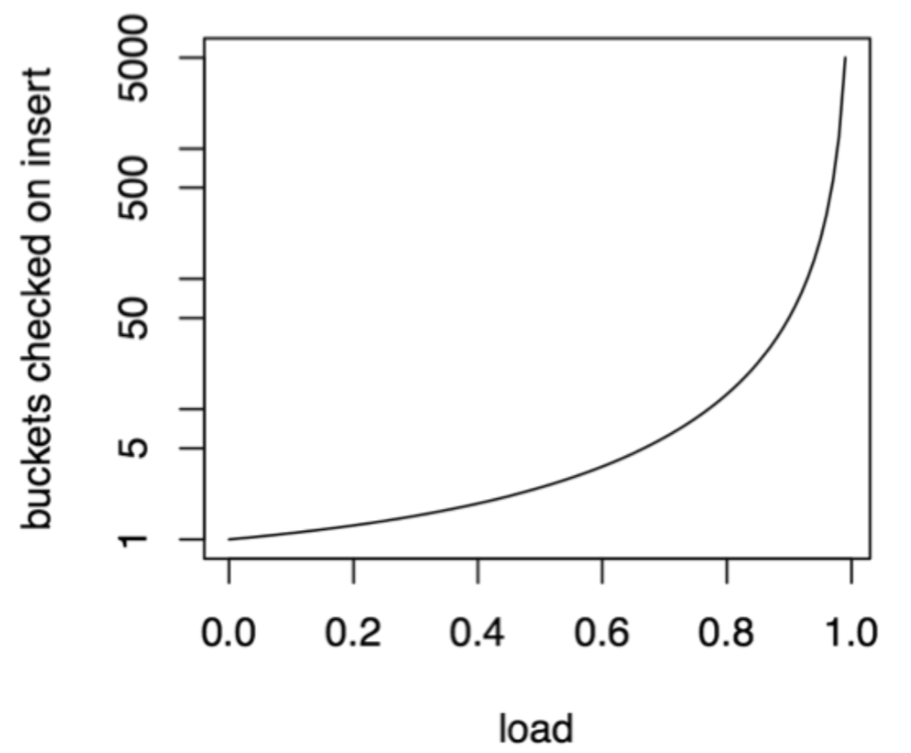
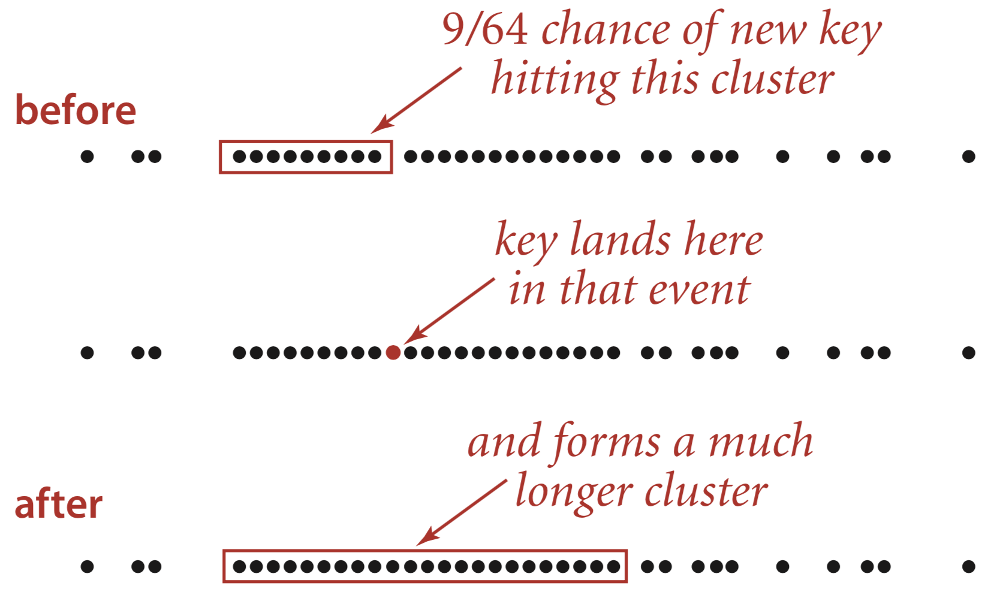
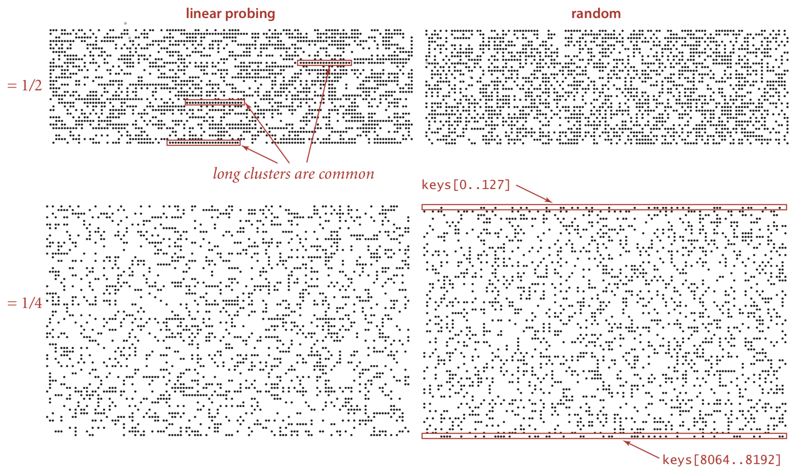
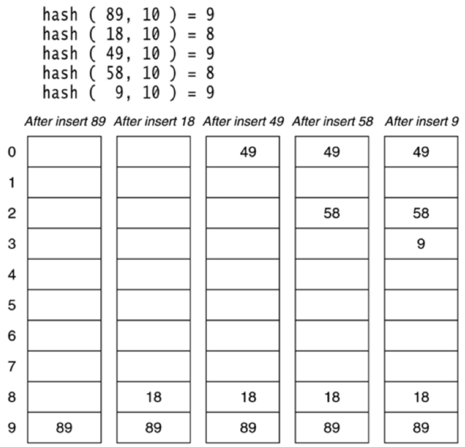
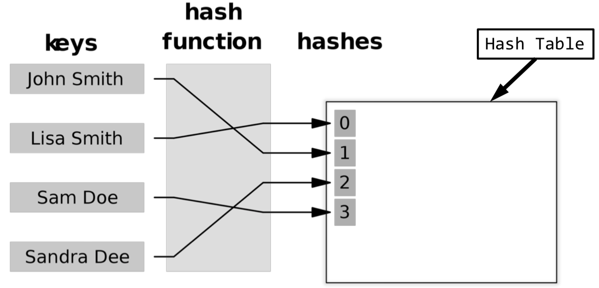

# Hashing (Part 3)

## Hash Table Overview

+ *Separate chaining*: expanding the single array entry into a linked list
  + Compute the integer hash code from the object
  + Bound the hash code by using modulo the length of the table
+ `add(T t)`: put the object `t` in the hash table
  + Add `t` into the list using `list.add(t)`
  + `rehash()` the whole table if the load is too high
+ `has(T t)`: check if `t` is in the list
  + `return list.contains(t)`
+ `remove(T t)`: delete `t` from the list
  + Just `list.remove(t)`

## Open Address Hashing

+ Separate chaining works well but has some disadvantages
  + Requires separate data structures to manage collisions (like a `List`)
  + Involves an additional level of indirection
  + Adding elements requires memory for allocation of nodes or lists and can be slow
+ An alternative approach: open address Hashing
  + Ban the use of additional data structures in the hash table
  + Store element references directly in the hash table array
  + **How can we handle collisions now?**
    + Basic design:
      + Hash table elements are stored in an array `hta` (with no auxiliary lists or trees)
      + Probe a sequence of entries for the object

~~~java
// Generic pseudocode for add(T t) with probing
pos <- abs(x.hashCode()) % hta.length
repeat
    if (hta[pos] is empty)
        hta[pos] = x
        return
    else
        pos = some other place
~~~

## Linear Probing

+ Linear probing strategy: if location $n$ is occupied, try $n+1$.
+ Process of `add(T t)`:  
  + Start with a normal insertion position `pos`
    + `pos = Math.abs(x.hashCode()) % hta.length`
    + Try the following sequence if `pos` yields an index which is already occupied:
      + `pos+1`, `pos+2`, ...
  
## Linear Probing Example

{ width=50% }

## Linear Probing (Continued)

+ How does `contains(T t)` work?
  + We'll need to check more than one slot
  + When do we stop and return false?
    + As a conservative option, only stop when we've tried all the entries in the table
    + As a more efficient option, stop when we hit a `null`
+ How does `remove(T t)` work?
  + Search for the value and set it to `null` if it's found
    + We can't risk removing it because it could possibly break a search chain, as illustrated in the next section

## Removal in Open Addressing

+ For `contains(T t)` or `remove(T t)` we need to follow the implicit chain
+ Suppose that when we use `remove(T t)`, it sets the position the element was in to `null`
  + If we sue our more efficient method of searching through the hash table, assuming linear probing, then we stop our search immediately upon hitting the gap that we've introduced.
  
    This is bad because the value we might want could be directly after the gap, if it was put there as the result of a collision.

## Avoid Breaking Chains

+ Don't set the removed records to `null`
+ Instead, use place-holders (colloquially called tombstones)
+ Example from Weiss:

    ~~~java
    private static class HashEntry {
        public Object element; // the element
        public boolean isActive; // false if marked deleted
        ...
    }
    ~~~

  + `remove(T t)` sets `isActive` to `false`
  + `add(T t)` and `contains(T t)` treat inactive slots as tombstones
  + `rehash()` ignores inactive entries

## Linear Probing Implementation

+ Loop starting from the location
  + `abs(x.hashCode()) % tableLength`
+ `add(T t)`
  + Loop until we find an empty slot or a tombstone
+ `contains(T t)`
  + Loop until we find `t` (or fail to do so); fail if we hit a `null` or we've tried all the entries
  + Finding a tombstone means that we keep searching
+ `remove(T t)`
  + Loop until we find `t` (or fail to do so); fail if we hit a `null` or we've tried all the entries
  + Finding a tombstone means that we keep searching
  + If we find `t`, make it a tombstone

## Linear Probing Issues

+ Discussion for `add(T t)`
  + Adjacent slots get filled first -- that means our hash table suffers from primary clustering
  + **Can `add(T t)` fail?**
    + **Under what conditions?**
    + **What do we do if it fails?**

## Linear Probing: Load

+ Load has a big effect on performance in linear probing
  + The `load` is defined by `item count / array length`
  + When the table is nearly full, we end up scanning most of the array
  + The `load` $\approx I \rightarrow O(n)$ for `add(T t)`, `contains(T t)`, and `remove(T t)`
+ Theorem
  + The average number of cells examined during insertion with linear probing is given by
  $$ \frac{1}{2} \left(1 + \frac{1}{(1-load)^2}\right)$$
  + This yields an exceptionally steep exponential growth curve of the number of buckets checked for an insertion with respect to the load:

{ width=50% }

## Linear Probing: Primary Clustering

{ width=50% }

{ width=100% }

## Rehashing

+ Rehashing is required for open address hashing
  + Tables will get full as we continue to add things to them, creating higher penalties for search and insertion
  + Even if the table isn't completely full, an arbitrarily high load might warrant a rehashing
    + Rehashing means we create a bigger hash table, and copy all of the elements over the to the new hash table by recomputing their hash code
+ We follow a similar procedure for rehashing when we use separate chaining
  + Allocate a new, larger array (the size should still be prime)
  + Copy over all the active items to the new array
    + We'll need to recalculate every item's hash code and re-insert them
    + What do we do if we have tombstones?
      + We can leave them behind! We only kept them in the first place so we didn't break search chains. Since we're essentially redoing the entire hash table, we'll develop new search chains as we copy the elements over to the new table.

## Quadratic Probing

+ Try the following sequence until an empty array element is found:
  + `pos`, `pos+1^2`, `pos+2^2`, ...
+ Features
  + Primary clustering isn't a problem since we're not putting things in adjacent cells
  + The complexity of this is **not** fully understood
    + There's no known relation between the load and the average number of cells searched
    + It's an interesting open research problem
  + Concerns
    + Is it guaranteed to find a spot to add if the table is not full?
      + Possibly, yes.
    + Is the exponentiation too expensive to compute?
      + Generally, no.

## Quadratic Probing Example

{ width=50% }

## Issues with Quadratic Probing

+ As an example, suppose that we have the following table:
  
  | Index | Contents |
  | :---: | :------: |
  | 0     | 48       |
  | 1     |          |
  | 2     | 5        |
  | 3     | 55       |
  | 4     |          |
  | 5     | 40       |
  | 6     | 76       |
  
  Assume then that we attempt to do `add(47)`:
  + `pos = 47 % 7 = 5` $\rightarrow$ fail
  + `5 + 12 = 6` $\rightarrow$ fail
  + `5 + 22 = 9, 9 % 7 = 2` $\rightarrow$ fail
  + `5 + 32 = 14, 14 % 7 = 0` $\rightarrow$ fail
  + `5 + 42 = 21, 21 % 7= 0` $\rightarrow$ fail
  + `5 + 52 = 30, 30 % 7 = 2` $\rightarrow$ fail
  + `5 + 62 = 41, 41 % 7 = 6` $\rightarrow$ fail
  + `5 + 72 = 54, 54 % 7 = 5` $\rightarrow$ fail
  + This pattern will repeat: $6, 2, 0, 0, 2, 6, 5, \dots$
  + We won’t be able to `add(47)` even though the table isn't full!

## Quadratic Probing (Good News Everyone!)

+ We don't have problems as long as the table size is prime **and** the load factor doesn't exceed 0.5 (Weiss, Theorem 20.4, pg 786)
  + As long as these premises are held, an item can always be inserted
  + Additionally, we gain the property that no cell is probed twice!
+ Quadratic probing can be done efficiently (Weiss, Theorem 20.4, pg 787)
  + Expense operations (like multiplication or exponentiation) can be avoided
    + As an example, $H_i = H_{i-1} + 2i - 1 \mod M$
    + We've gotten rid of the need for exponentiation, and only use multiplication by two, which is usually trivially compiled into a logical shift

## Secondary Clustering

+ Two values with the same initial position will have the same moves while probing
+ A popular solution is to use a technique called *double hashing*
+ Double hashing:
  + The initial position is decided by the first hashing function, as usual
  + If the resulting index is occupied, use a second hash function for probing
    + So instead of checking `pos + Hash(x)`, `pos + 2*Hash(x)`, and so on, we check `pos + Hash2(x)`, `pos + 2*Hash2(x)`, et al.

## Double Hashing

+ The second hash function $H_2$ can't be zero
+ It also should distribute evenly between all the cells
+ A common choice:
  + `Hash(k) = k % tableSize`
  + `Hash2(k) = (prime - (k % prime))`, where the prime is less than the size of the table
  + `next_location(i, k) = (Hash(k) + i * Hash2(k)) % tableSize`

## Double Hashing Example

+ Given the primary hash function `Hash(k) = k % 11` and the secondary hash function `Hash2(k) = (7 - (k % 7))`:
  + `add(15)`
    + `Hash(15) = 4`
    + `Hash2(15) = 7 - (15 % 7) = 6`
    + Sequence for probing is $4, 10, 5, 0, 6, 1, 7, \dots$
  + `add(26)`
    + `Hash(26) = 4`
    + `Hash2(26) = 7 - (26 % 7) = 2`
    + Sequence for probing is $4, 6, 8, 10, 1, 3, 5, \dots$

## Hash Table Example

{ width=50% }

## Dictionary

+ A dictionary defines a mapping between a key and a value
  + It can be implemented using a hash table
  + Keys are unique
  + Keys are hashable (their hash code is used to decide where to store them)
  + Hash table entries contain the pair

{ width=50% }

## Sets vs. Maps

+ Sets
  + Just like the mathematical set... except it can't be infinite (which is a bummer)
  + Unordered collection of items
  + No duplicates allowed
+ Maps
  + Essentially some relation $M$ defined by $M\subset K \times V$ where $K$ is the set of keys, and $V$ is the **list** of values (the values are not necessarily unique).
  + Each key maps to a value
    + As an example, the key `"G00123123"` might map to `"Sam Samson"`
  + Python dictionaries are maps
+ Both are usually implemented with a hash table
  + We can typically implement them with normal lists, ordered or unordered

## Operations on Sets or Maps

### Sets

+ `add(T t)`: add the value to the set if it's not in the set yet
+ `remove(T t)`: remove the value from the set
+ `has(T t)`: find out if the value is contained in the set

### Maps

+ `put(K k, V v)`: puts the value `v` at the key `k`'s location
+ `remove(K k)`: remove the value associated with the given key
+ `has(K k)`: find out if the key is contained in the set of keys
+ `get(K k)`: get the value associated with the given key

## Implementation

+ You can build a `Set` out of a `Map`
  + We really only need a hash table that does not allow duplicates
  + We don't actually need a pair of keys and values
    + We can keep the value and key to be the same;
    + Or we can use only the key, and have the values be null
+ Examples:
  + Java's own `HashSet`
  + Weiss 6.7.2
+ You can also build a `Map` out of a `Set`
  + We get `add(T t)`, `remove(T t)`, and `has(T t)` for free
  + We can construct a set with items as a pair of keys and values
  + We need to support `has(K k)`, `get(K k)`, `remove(K k)`, and `put(K k, V v)`
    + Keys need to be unique, so we'll have to ensure that property holds
  + Essentially we need to compare and / or hash items based only on their key
    + *Key-Value pairs are thus said to be equal if their keys are equal*
  + See Weiss 6.8 for more

## Hashing Summary

+ Hash tables provide $O(1)$ `add(T t)`, `remove(T t)`, and `contains(T t)`
+ Hashing functions compute hash codes
  + They must be easy to compute
  + They must distribute well
  + And the *should* make use of prime numbers
+ Hash collisions can be mitigated with:
  + Separate chaining
    + in which each hash bucket is a list
  + Or in open address hashing
    + Where we look at buckets using some sequence
      + Either in a linear or quadratic fashion, or by using double hashing

## Hash Table Big-O

| Approaches | Cases | `add(T t)`$^*$ | `has(T t)` | `remove(T t)` | iterate |
| :--------: | :---: | :------------: | :--------: | :-----------: | :-----: |
| Separate Chaining | Average | $O(n/m)$ | $O(n/m)$ | $O(n/m)$ | $O(n+m)$ |
|                   | Worst   | $O(n)$   | $O(n)$   | $O(n)$   | $O(n+m)$ |
| Open Addressing   | Average$^{**}$ | $O(1)$ | $O(1)$ | $O(1)$ | $O(m)$ |
|                   | Worst        | $O(n)$ | $O(n)$ | $O(n)$ | $O(m)$ |

+ $n$: the number of values in the hash table
+ $m$: the number of entries (the array capacity)
+ $^*$: assumes no duplicates are allowed, and does not consider rehash overhead
+ $^{**}$: if load is low and a good hash function is used

## Next Lecture

+ Project 3
  + Binary search tree
+ Topic: Graphs
  + Reading: Chapter 14
