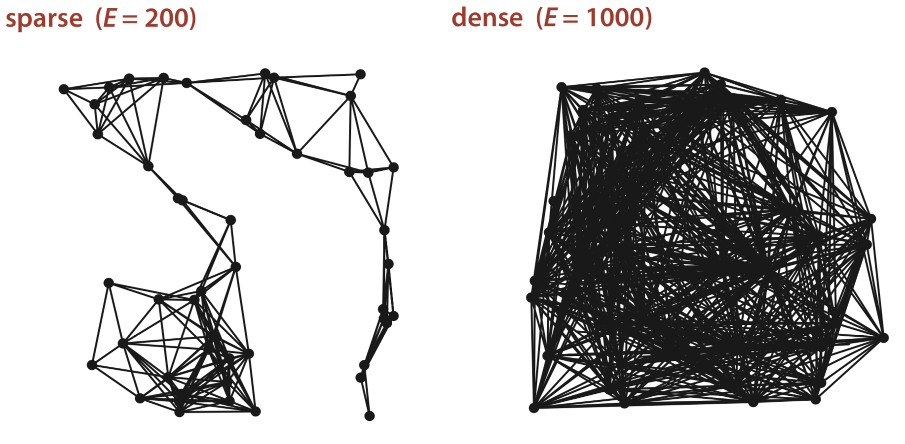
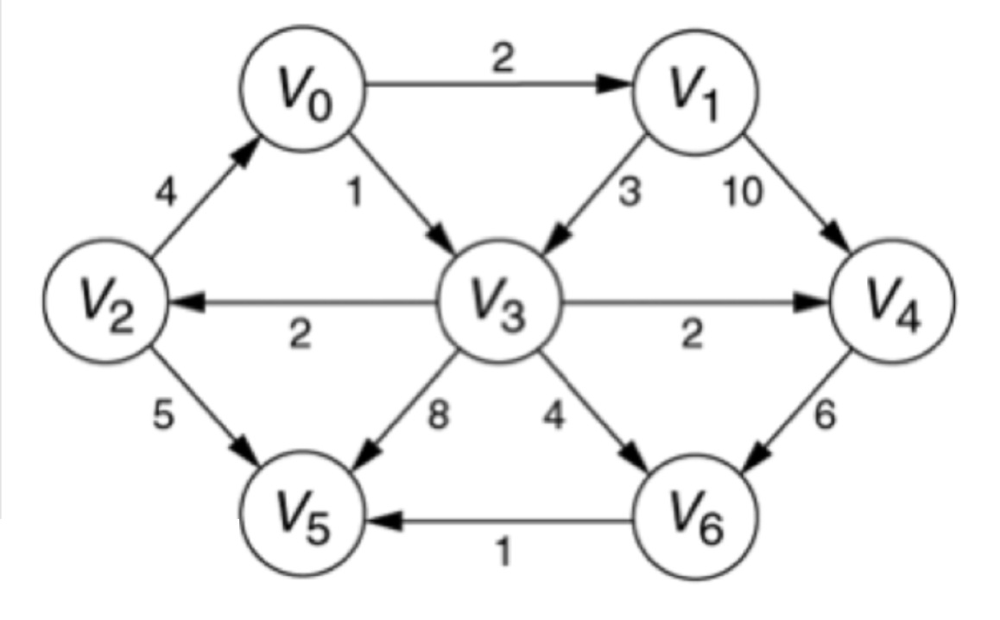

# Graphs (Part 1)

## Graphs

+ A graph is defined as the set $G = (V, E)$, where
  + $V$ is a set of vertices or nodes
  + $E$ is a set of edges, where each edge is pair $(v,w)$ and $v,w\in V$
+ We checked trees before
  + Trees are DAGs (directed acyclic graphs)
  + General graphs usually have edges with more features

## Edge Features

+ Edge direction
  + Directed graphs: $(u,v)$ and $(v,u)$ are not the same
+ Edge weight
  + There can be a cost associated with the edge. When we think of edges as tuples, we can think of the cost $c$ as making a coordinate pair a triplet $(u,v,c)$.

## Types of Graphs

+ Directed vs. Undirected
  + Presence or absence of weighted edges
+ Weighted vs. Unweighted
  + Presence or absence of edge weights
+ Cyclic vs. Acyclic
  + Presence or absence of cycles
+ Dense vs. Sparse
  + Presence or absence of a large number of edges relative to the number of vertices
+ Connected vs. Disconnected
  + Presence or absence of the property that there is a path from every vertex to every other vertex (when a graph has this property, we call it *strongly connected*)

## Dense/Sparse Graphs

{ width=50% }

## Terms

+ Nodes (also called vertices when specifically talking about graphs)
  + $|V|$ is the number of vertices
+ Edges
  + $|E|$ is the number of edges
  + It is always true that $|E| \leq |V|^2$
+ Connection
  + Vertex $w$ is adjacent to vertex $v$ iff. $(v,w) \in E$
    + *Directed graph*: $w$ is adjacent to $v\neq v$ is adjacent to $w$
  + A *path* is a sequence of vertices connected by edges
    + A sequence of edges $w_1, w_2, \dots, w_n$ is a path iff. $(w_i, w_{i+1}) \in E$ for all $i$
    + *Path length*: the length of a path is defined by the number of edges divided by the sum of the edge weights

## Graph Example

{ width=50% }

+ Directed, weighted graph
+ $|V| = 7$
+ $|E| = 12$
+ Which vertices are adjacent to $V_3$?
  + $V_2, V_4, V_5, V_6$
+ List a path from $V_3$ to $V_1$
  + $V_3, V_2, V_0, V_1$
  + Unweighted path length: 3
  + Weighted path length: 2 + 4 + 2 = 8

## Review: Graphs

### General Graph Terms

+ $|V|$ and $|E|$
+ Adjacent vertices
+ Simple path
+ Cycle
+ Degree (of a vertex)

### Types of Graphs

+ Directed vs. Undirected
+ Weighted vs. Unweighted
+ Cyclic vs. Acyclic
+ Dense vs. Sparse
+ Connected vs. Disconnected
+ DAG

## More Terms

+ *Simple path*: a path where all the vertices are distinct except the first and last, which can be the same
+ *Cycle*: a path that begins and ends at the same vertex and contains at least one edge
  + Simple cycle follows from the definition of simple path above
+ Vertex $v$ is reachable from vertex $2$ if there is a path from $w$ to $v$
+ *Degree of a vertex*: the number of edges incident to it
  + *Indegree of $v$*: the number of incoming edges $(u,v)$
  + *Outdegree of $v$*: the number of outgoing edges $(v,w)$

## Graph Example

{ width=50% }

+ List a path
  + $V_3, V_2, V_0, V_3, V_6, V_5$
+ List a simple path
  + $V_3, V_2, V_0, V_1, V_3$
+ List a cycle
  + $V_3, V_2, V_0, V_3, V_2, V_0, V_3$
+ List a simple cycle
  + $V_3, V_2, V_0, V_1, V_3$
+ Is $V_0$ reachable from $V_5$?
  + No it is not ($V_5$ has outdegree zero)
+ Is $V_0$ reachable from $V_1$?
  + Yes, we have the path $V_1, V_3, V_2, V_0$
+ Degree of $V_3$: 6
  + Indegree: 2
  + Outdegree: 4

## Graphs Everywhere

+ They can represent a wide variety of data or relations
  + Genetic distances
  + Airline flights and costs
  + Migration patterns
  + Function call graphs

## Road Map

+ Graph basics
  + Definitions and terms
  + Applications
+ Graph representations
  + Adjacency matrix
  + Adjacency list
+ Graph algorithms
  + Graph traversal
  + Shortest path problem
  + Many more
