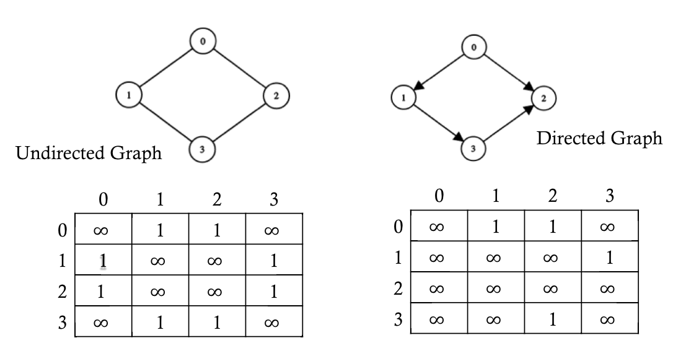
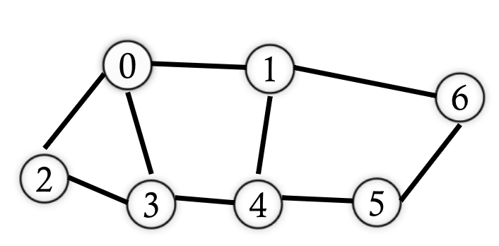

# Graphs (Part 2)

## Road Map

+ Graph basics
  + Definitions and terms
  + Applications
+ Graph representations
  + Adjacency matrix
  + Adjacency list
+ Graph algorithms
  + Graph traversal
  + Shortest path problem
  + Many more

## Graph Representation

+ *Graph*: a set of vertices $V$ and edges $E$
+ Representation: the way in which we store a graph in programs
  + Adjacency matrix: a 2D array `A[n][n]` where $n = |V|$
    + `A[v][w]` is the weight of $(v,w)$
    + `A[v][w]` is infinity if $v,w$ is not in the graph
  + Adjacency list
    + A group of $|V|$ linked lists
    + List `v`: a list of all nodes $w$ such that there is an edge $(v, w)$

## Adjacency Matrix

## Adjacency List

Using the same image as above for reference, we have the following adjacency lists:

+ Undirected graph
  + $0 \rightarrow 1 \rightarrow 2$
  + $1 \rightarrow 0 \rightarrow 3$
  + $2 \rightarrow 0 \rightarrow 3$
  + $3 \rightarrow 1 \rightarrow 2$
+ Directed graph
  + $0 \rightarrow 1 \rightarrow 2$
  + $1 \rightarrow 3$
  + $2 \rightarrow$ `null` (empty list)
  + $3 \rightarrow 2$

## Complexity

+ Adjacency matrix
  + Space cost: $O(|V|^2)$
  + Initialization time: $O(|V|^2)$
  + Fine with dense graphs, not so great for sparse ones
+ Adjacency list
  + Space cost: $O(|V| + |E|) = O(|E|)$
  + Initialization time: linear from a list of edges
    + Most cases, we skip the checking of duplicate edges (even though they might come with different edge weights)
+ How do we add, remove, or find a node or edge?

## Graph Representation Example

## Graph Traversal and Searching

+ Basis of many graph algorithms
+ The general idea
  + Given a starting point, visit, check, or update every vertex in a graph by following the given edges
+ Application examples
  + Connected components
  + Topological sorting
  + Minimum spanning tree (MST)
  + Shortest path
  + Many more
+ Procedure
  + Given a starting point, visit, check, or update every vertex in a graph by following the given edges
  + Order: which vertex do we visit next?
+ Basic approaches
  + *Breadth-first*: visit vertices in layers -- those closest to the start are visited first, and those most distant are visited last
  + *Depth-first*: from the starting vertex, explore as far as possible along each path before backtracking
  + Remember tree traversals? They're baaaaaaack!

## Breadth-First Traversal

+ Given the starting point $S$
  + Visit all the nodes that are one edge away ($S$'s direct neighbors)
  + Visit all nodes that are two edges away (neighbors of neighbors)
  + Visit all nodes that are three edges away (neighbors of neighbors of neighbors)
  + ...
  + Repeat this until all nodes have been visited

## Traversal Example: Breadth-First

{ width=50% }

+ A breadth-first traversal starting with $0$: $\{0\}$
  + Visit all the nodes adjacent to $0$: $\{0, 1, 2, 3\}$
  + Visit all the neighbors of those nodes: $\{0, 1, 2, 3, 4, 6\}$
  + Continue the process: $\{0, 1, 2, 3, 4, 6, 5\}$
  + We've reached all the nodes, so we can stop. We've also found that every node in this graph can be reached by a path of at most length $3$.

## Breadth-First Traversal Implementation

+ Have we done something similar to this before?
  + Yes, and depending on your progress in Project 3 you might still be doing it.
+ We can use a queue
  + Initialize by enqueueing the starting vertex
  + Mark it as visited when we enqueue
  + Process the vertives in a first-in first-out (FIFO) order:
    + Dequeue the first vertex $v$
    + Enqueue $v$'s neighbor that has not yet been visited or marked

## Depth-First Traversal

+ Given the starting point $S$
  + Visit the first neighbor of $S$
  + Visit the first neighbor of the first neighbor of $S$
  + Visit the first neighbor fo the first neighbor of the first neighbor of $S$
  + Repeat this process until there are no more nodes to go, then back, trying the second neighbor of $S$
  + Repeat that process until we've processed all of the neighbors of $S$

## Traversal Example: Depth-First

{ width=50% }

A depth-first traversal starting with $0$: $\{0\}$

Pick one neighbor of $0$: $1$. Then the set of nodes visited is $\{0, 1\}$.

+ Pick one neighbor of $1$: $4$. Then the set of nodes visited is $\{0, 1, 4\}$.
  + Pick one neighbor of $4$: $3$. Then the set of nodes visited is $\{0, 1, 4, 3\}$.
    + Pick one neighbor of $3$: $2$. Then the set of nodes visited is $\{0, 1, 4, 3, 2\}$.
      + Pick one neighbor of $2$: $2$ has no neighbors that we haven't visited already, so we backtrack to $3$.
    + Pick one neighbor of $3$: $3$ has no neighbors that we haven't visited already, so we backtrack to $4$. Then the set of nodes visited is $\{0, 1, 4, 3, 2\}$.
  + Pick one neighbor of $4$: $5$. Then the set of nodes visited is $\{0, 1, 4, 3, 2, 5\}$.
    + Pick one neighbor of $5$: $6$. Then the set of nodes visited is $\{0, 1, 4, 3, 2, 5, 6\}$.
      + Pick one neighbor of $6$: $6$ has no neighbors that we haven't visited already, so we backtrack to $5$.
    + Pick one neighbor of $5$: $5$ has no neighbors that we haven't visited already, so we backtrack to $4$.
  + Pick one neighbor of $4$: $4$ has no neighbors that we haven't visited already, so we backtrack to $1$.
+ Pick one neighbor of $1$: $1$ has no neighbors that we haven't visited already, so we backtrack to $0$.
  
Pick one neighbor of $0$: $0$ has no neighbors that we haven't visited already, and we cannot backtrack further, so we're done.

Therefore, our result is $\{0, 1, 4, 3, 2, 5\}$.

## Depth-First Traversal Implementation

+ Implementation qualms:
  + How do we implement backtracking?
    + With recursion, or equivalently, a stack
  + Is a post-order tree traversal depth-first when applied to graphs? What about a pre-order traversal? What about an in-order traversal?
+ Using recursion (or a stack)
  + We push nodes with unvisited neighbors onto the stack
  + Pick an unvisited neighbor to continue
    + If there are no more unvisited neighbors, pop out the node and backtrack

## Visualization

+ Breadth-first traversal
  + <https://www.cs.usfca.edu/~galles/visualization/BFS.html>
+ Depth-first traversal
  + <https://www.cs.usfca.edu/~galles/visualization/DFS.html>

## Shortest Path Problem

+ Task: given a designated vertex $S$, find the shortest path for every vertex $v$ starting from $S$
  + For an unweighted graph, length is measured by the number of edges of the path
  + For a weighted graph, length is measured by the sum of the weights of all the edges of the path
+ Algorithms
  + Unweighted graph: breadth-first traversal (Weiss 14.2)
  + Positive-weighted graph: Dijkstra's algorithm (Weiss 14.3)
  + Negative-weighted graph: Bellman-Ford algorithm (Weiss 14.4)

## Unweighted Shortest Path Problem

+ The breadth first traversal already gives us a solution to this version of the problem!
  1. Start with vertex $S$
  2. Visit all the nodes adjacent to $S$ (shortest path length = $1$)
  3. Visit all the nodes not yet visited but adjacent to nodes visited in the last step (shortest path length = $2$)
  4. Repeat step 3 with an increased path length, until all the nodes have been visited

## Shortest Path Example

{ width=50% }

+ Using a breadth-first traversal, and starting with $0$: $\{0\}$
  + Visit all the nodes adjacent to $0$: $\{0, 1, 2, 3\}$ (one edge away)
    + Paths established: $\{0, 1\}, \{0, 3\}, \{0, 2\}$
  + Visit neighbors of neighbors: $\{0, 1, 2, 3, 4, 6\}$
    + Paths established: $\{0, 1\}, \{0, 3\}, \{0, 2\}, \{0, 1, 4\}, \{0, 1, 6\}$
  + Visit neighbors of neighbors: $\{0, 1, 2, 3, 4, 6, 5\}$
    + Paths established: $\{0, 1\}, \{0, 3\}, \{0, 2\}, \{0, 1, 4\}, \{0, 1, 6\}, \{0, 1, 4, 5\}$

Node | Prev | Dist | Adjacency List
:--: | :--: | :--: | :------------:
  0  |  0   |  0   | 1, 2, 3
  1  |  0   |  1   | 0, 4, 6
  2  |  0   |  1   | 0, 3
  3  |  0   |  1   | 0, 2, 4
  4  |  1   |  2   | 1, 3, 5
  5  |  4   |  3   | 4, 6
  6  |  1   |  2   | 1, 5

