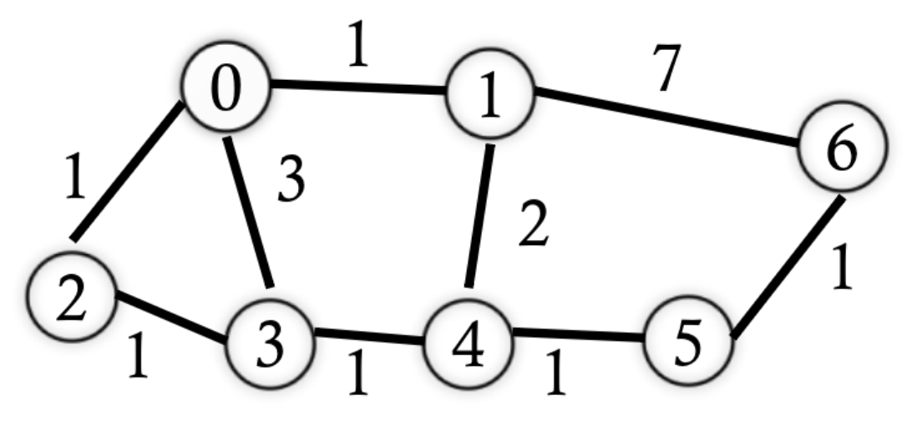
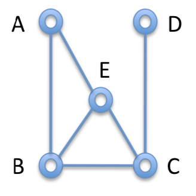
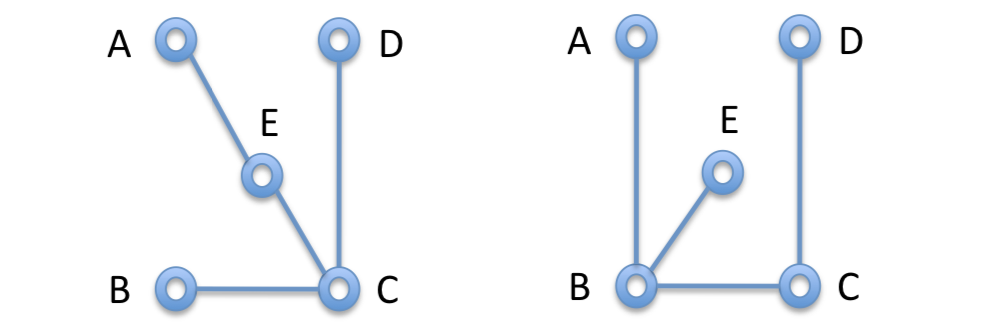
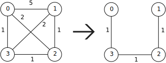

# Graphs (Part 3)

## Positive Weighted Shortest Path

+ Weighted graph
  + A path with fewer edges may not have a lower cost, since each edge carries its own weight
  + We must calculate and compare the total weight
+ Example:
  
  { width=50% }

  + What's the shortest path from $0$ to $6$?
    + Shortest in terms of edges:
      + The path $\{0, 1, 6\}$ with weight $8$
    + Shortest in terms of weight:
      + The path $\{0, 1, 4 ,5, 6\}$ with weight $5$
+ As a general solution, we can use *Dijkstra's Algorithm*
  + We don't allow negative edges
  + Each node remembers the current shortest path (the previous path and the distance)
    + All nodes start at $\infty$, except for the starting node $S$
  + Repeat the following until all nodes have been marked:
    + Take the node $m$ which has the minimum distance among all nodes that have not been marked and mark it
    + Update the unmarked nodes connected to node $m$ if the path via $m$ is shorter

## Example of Dijkstra's Algorithm

Suppose we want to find the shortest path given the following graph, and starting at vertex $0$.

{ width=50% }

Node        | 0 |    1    |    2    |    3    |    4    |    5    |    6    |
:---------: |:-:|   :-:   |   :-:   |   :-:   |   :-:   |   :-:   |   :-:   |
Path Length | 0 |$\infty$ |$\infty$ |$\infty$ |$\infty$ |$\infty$ |$\infty$ |
Prev        | 0 |    -    |    -    |    -    |    -    |    -    |    -    |

+ Starting vertex $0$
  + Updating for vertices $1$, $2$, and $3$
+ Paths: $\{\}$

Node        | 0 |    1    |    2    |    3    |    4    |    5    |    6    |
:---------: |:-:|   :-:   |   :-:   |   :-:   |   :-:   |   :-:   |   :-:   |
Path Length | 0 |    1    |    1    |    3    |$\infty$ |$\infty$ |$\infty$ |
Prev        | 0 |    0    |    0    |    0    |    -    |    -    |    -    |

+ Next vertex $1$
  + Updating for vertices $4$ and $6$
+ Paths: $\{0, 1\}$

Node        | 0 |    1    |    2    |    3    |    4    |    5    |    6    |
:---------: |:-:|   :-:   |   :-:   |   :-:   |   :-:   |   :-:   |   :-:   |
Path Length | 0 |    1    |    1    |    3    |    3    |$\infty$ |    8    |
Prev        | 0 |    0    |    0    |    0    |    1    |    -    |    1    |

+ Next vertex $2$
  + Updating for vertex $3$
+ Paths: $\{0, 1\}, \{0, 2\}$

Node        | 0 |    1    |    2    |    3    |    4    |    5    |    6    |
:---------: |:-:|   :-:   |   :-:   |   :-:   |   :-:   |   :-:   |   :-:   |
Path Length | 0 |    1    |    1    | ~~3~~ 2 |    3    |$\infty$ |    8    |
Prev        | 0 |    0    |    0    | ~~0~~ 2 |    1    |    -    |    1    |

+ Next vertex $3$
  + Updating for vertex $3$
    + Reached every node, update nothing
+ Paths: $\{0, 1\}, \{0, 2\}, \{0, 2, 3\}$

Node        | 0 |    1    |    2    |    3    |    4    |    5    |    6    |
:---------: |:-:|   :-:   |   :-:   |   :-:   |   :-:   |   :-:   |   :-:   |
Path Length | 0 |    1    |    1    | ~~3~~ 2 |    3    |    4    | ~~8~~ 5 |
Prev        | 0 |    0    |    0    | ~~0~~ 2 |    1    |    4    | ~~1~~ 5 |

+ Next vertex $4$
  + Updating for vertex $5$
+ Paths: $\{0, 1\}, \{0, 2\}, \{0, 2, 3\}, \{0, 1, 4\}, \{0, 1, 4, 5\}, \{0, 1, 4, 5, 6\}$

Our final record is then 

Node        | 0 |    1    |    2    |    3    |    4    |    5    |    6    |
:---------: |:-:|   :-:   |   :-:   |   :-:   |   :-:   |   :-:   |   :-:   |
Path Length | 0 |    1    |    1    | ~~3~~ 2 |    3    |    4    | ~~8~~ 5 |
Prev        | 0 |    0    |    0    | ~~0~~ 2 |    1    |    4    | ~~1~~ 5 |

+ Prev: the previous node in the shortest path starting from $0$
+ Path length: length of the corresponding shortest path
+ **What data structure would we use for implementing something like this?**
  + **Perhaps a priority queue?**

## Dijkstra's SP Algorithm

Assume that you're given a weighted, directed graph with a source vertex `s`.
  
  1. Make sure all the edges of the graph are non-negative
  2. Set `distTo[V] = Double.MAX_VALUE`, `distTo[s] = 0.0`, and `prev[V] = null`
  3. Initialize a minimum priority queue `minPQ` with all the nodes
  4. While `minPQ` is not empty:

  ~~~java
  Remove next vertex v from minPQ with the lowest distTo
  for each neighbor u of v:
    alt = distTo[v] + weight(u,v)
    if alt < distTo[u]:
      distTo[u] = alt
      prev[u] = v
  Add v to SP
  ~~~

*Note: Other algorithms like Bellman-Ford work even when negative weights are included.*

## A Few Well-Known Graph Problems

+ Cycle detection
+ Connected components
+ Spanning trees
+ Topological sorting
+ Maximum flow
+ Graph coloring
+ Traveling Salesman Problem

## Spanning Trees

+ A *spanning tree* of a graph is a subgraph that contains all the vertices of the graph and is a tree
  + All the nodes are connected
  + All of the edges are from the graph (no new edges), and there are no cycles

## Spanning Tree Example

Given the graph

{ width=20% }

we can make several different spanning trees (two are below).

{ width=50% }

In general, one might ask how many different spanning trees exist for any graph. The answer would be to use the *Tutte Polynomial* (more on that here <http://mathworld.wolfram.com/TuttePolynomial.html>).

For more on spanning trees, see <https://www.cs.cmu.edu/~fp/courses/15122-f10/lectures/24-spanning.pdf>.

## Minimum Spanning Trees (MST)

+ *Minimum Spanning Tree (MST)*: a spanning tree with the minimum possible total edge weight

{ width=50% }

### MST Algorithms

+ Idea: identify which edges should be included such that
  + All nodes are connected
  + No cycle is formed
  + Total weight is minimized
+ Kruskal's Algorithm (use a priority queue and or heap)
  + Sort edges based on their weights in ascending order
  + For each step, pick the lowest weighted one to add to the tree $T$ unless it would create a cycle
+ Prim's Algorithm (use a disjoint set)
  + Start with any vertex $S$ and greedily grow a tree $T$ from $S$
  + For each step, pick the minimum edges that connects the current $T$ and $(G-T)$
    + Don't confuse this algorithm with Dijkstra's!
+ Both Kruskal's and Prim's algorithms are greedy
  + That means that they make locally optimal choices at each stage, with the intent of finding a global optimum (note: not *the* global optimum, *a* global optimum*)
  + In many problems, a greedy strategy does not produce an optimal solution
+ There are lots of other MST algorithms
  + <https://en.wikipedia.org/wiki/Minimum_spanning_tree>

## Summary

+ Graphs
  + Basic definitions and terms
+ Graph representation
  + Adjacency matrix and adjacency list
+ Graph algorithms
  + Graph traversals
  + Shortest path problem
  + MST problem

## Next Lecture

+ Priority queues
  + Reading: Chapter 6.9, Chapter 21