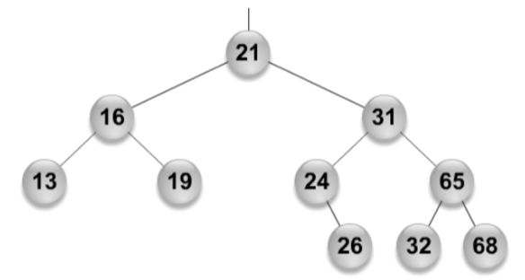
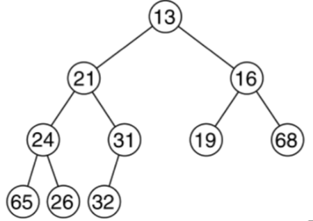
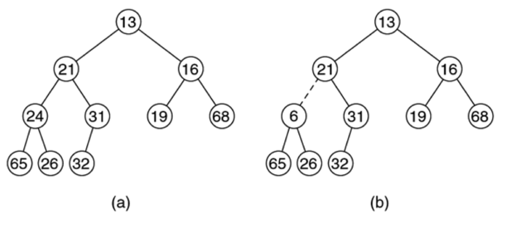
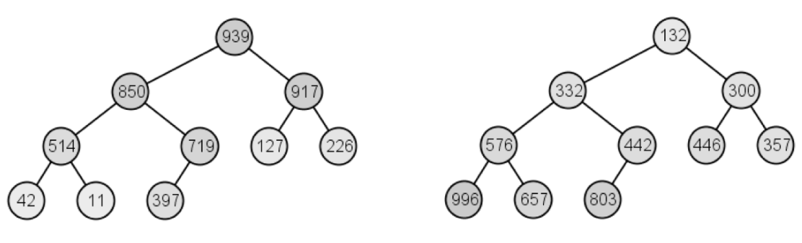
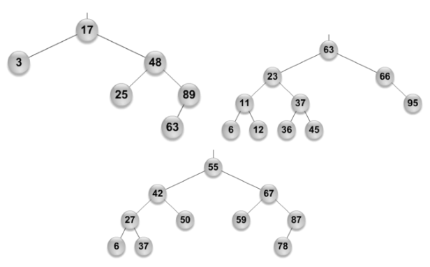
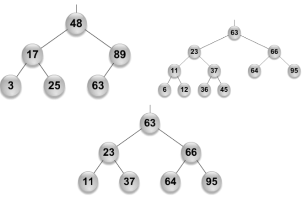

# Priority Queues and Binary Heaps (Part 1)

## Review: Queues

+ First in, first out (FIFO)
+ Operations:
  + `getFront()`, `enqueue(T t)`, and `dequeue()`
  + `size()` and `isEmpty()`
+ Applications
  + Simulate a process with FIFO ordering
  + Scheduling the queue in a CPU, disk, or printer
  + Buffer for file I/O, network communication, or other transmissions
+ A lot of the time, tasks in a queue have priorities
  + Dequeue should remove or return the one with the best priority
+ Common priority queue operations
  + `add(T t, int p)` and `enqueue(T t, int p)`: enqueue item `t` with priority `p`
  + `peek()` and `findMin()`: return the object with the best priority
    + Per convention, lower is better
    + Symmetric code if higher is better
  + `dequeue()` and `deleteMin()`: remove and return the object with the best priority

## Priority Queue Implementation

Data Structure     | `enqueue(T t)`   | peek$^*$      | dequeue$^*$   | Notes
:-------------:    | :--------------: | :--------:    | :----------:  | :------:
Unsorted List      | $O(1)$           | $O(n)$        | $O(n)$        | best priority can be any location
Sorted Array       | $O(n)$           | $O(1)$        | $O(1)$        | best priority at high index
Sorted Linked List | $O(n)$           | $O(1)$        | $O(1)$        | best at head or tail
Multiple Queues    | $O(1)$           | $O(m)$        | $O(m)$        | -
Binary Search Tree | $O($height$)$    | $O($height$)$ | $O($height$)$ | min at left-most

+ $^*$: assuming best priority
+ $n$: the number of items in a queue
+ $m$: the number of priority levels

## Binary Heap

+ A *binary heap* is a binary tree but *not* a binary search tree
+ Differences:
  + Sort of sorted: each node is smaller than, or equal to, both its children
  + Must be a complete binary tree

{ width=50% }

{ width=50% }

## Sorted Binary Heap Example

{ width=50% }

## Heap Order

+ Max heap
  + The node is always larger than, or equal to, any of its descendants
+ Min heap
  + The node is always smaller than, or equal to, any of its descendants
+ Idea: we want to find the min, or max, quickly
  + Keep at the root of the tree
  + Recursive definition: every subtree should have the largest, or smallest, item at the root of the subtree

## Binary Heap Examples

+ **Is it a heap or not?**
  + **If it is, what kind of heap is it?**

{ width=75% }

## Complete Trees

+ Could only be missing nodes in their bottom row
+ Nodes in the bottom row are as far lest as possible

{ width=50% }

{ width=50% }

## Trees and Heaps in Arrays

{ width=50% }

+ The root is at index 1
+ Binary tree
  + `left(i) = 2 * i`
  + `right(i) = 2 * i + 1`
  + `parent(i) = i / 2`

## Road Map

+ Priority queue
  + `insert(T t)`, `findMin()`, `deleteMin()`
+ Heap
  + Complete binary tree
  + Heap order
    + Min heap
    + Max heap
  + Operations and complexity
    + Insert: percolate up
    + Delete: percolate down
+ Heap sort

## Priority Queue Operations with Binary Heaps

+ Use an internal `T array[]` for queue contents
  + Maintain min-heap order in array
  + Make sure it is always a complete tree
+ `T findMin()`
  + `return array[root()];`
+ `insert(T t, int p)`
  + Insert at the end of the array, increment size
    + Might violate the min-heap order property
  + Fix by swimming the new element up (percolate up)
+ `deleteMin()`
  + Simply removing the root will leave a hole
  + We can swap the last value and the root to fill the hole
    + `null` out the last value (which prevents loitering)
    + Decrement the size
    + The new root *might* not be minimal
  + Percolate the new root value down the tree
+ Max heap follows the same ideas

## Binary Heap Demo

+ Starting from a min-heap like Example 2
  + Insert 50, 18, and 10
  + `deleteMin()`
+ Starting form an empty max-heap
  + Insert 2, 3, 5, 3, and 9
  + `deleteMax()` five times

## Operation Details

+ Basic questions
  + With whom do we compare or swap?
  + When do we stop moving?
+ Percolate up (bubble up)
  + Compare / swap with the parent
  + Halting condition: when we reach the top (the root) or no longer violate the heap order
+ Percolate down (sink down)
  + Compare / swap with a child
  + Halting condition: when we reach the bottom (a leaf) or no longer violate the heap order

## Weiss Code Example

~~~java
/**
 * Removes the smallest item in the priority queue.
 * @return the smallest item.
 * @throws NoSuchElementException if empty.
 */
public T remove() {
  T minItem = element();
  // Move the tail element to the root
  array[1] = array[currentSize--];
  // Sink the new root down to fix the heap order
  percolateDown(1);
}

 /**
  * Internal method to percolate down in the heap.
  * @param hole the index at which to percolate begins.
  */
private void percolateDown(int hole) {
  int child;
  T tmp = array[hole];
  // Decide which child to compare/swap
  for (; hole * 2 <= currentSize; hole = child) {
    child = hole * 2;
    if (child != currentSize && compare(array[child+1], array[child]) < 0) {
      child++;
    }
    // Keep swapping with children until parent-child comparison result is 
    // satisfactory, or the bottom is reached
    if (compare(array[child], tmp) < 0) {
      array[hole] = array[child];
    } else {
      break;
    }
    array[hole] = tmp;
  }
}
~~~

## Complexity Analysis

+ `findMin()` is clearly $O(1)$
+ What about `insert(T t)` and `deleteMin()`?
  + Percolation does most of the work
  + Worst case: $O($height$)$
    + Complete binary tree: $O(\log(n))$
+ Note: no `get(T t)` or `remove(T t)`

## Priority Queues Comparison

Data Structure     | `enqueue(T t)`   | peek$^*$      | dequeue$^*$   | Notes
:-------------:    | :--------------: | :--------:    | :----------:  | :------:
Unsorted List      | $O(1)$           | $O(n)$        | $O(n)$        | best priority can be any location
Sorted Array       | $O(n)$           | $O(1)$        | $O(1)$        | best priority at high index
Sorted Linked List | $O(n)$           | $O(1)$        | $O(1)$        | best at head or tail
Multiple Queues    | $O(1)$           | $O(m)$        | $O(m)$        | -
Binary Search Tree | $O($height$)$    | $O($height$)$ | $O($height$)$ | min at left-most
Binary Heap        | $O(\log(n))$     | $O(1)$        | $O(\log(n))$  | best priority at root

+ $^*$: assuming best priority
+ $n$: the number of items in a queue
+ $m$: the number of priority levels