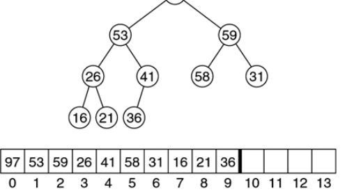
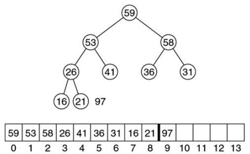
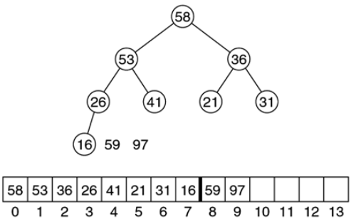
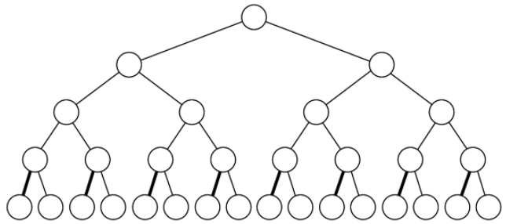
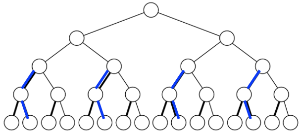
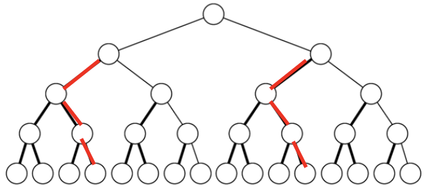
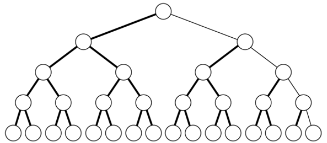

# Priority Queues and Binary Heaps (Part 2)

## Heaps for Sorting

+ How would you use a priority queue or a heap to sort a collection of values?
  + Max heap: Sort in descending order
  + Min heap: Sort in ascending order
+ Steps: insert and delete
  + First, insert each value into the heap
  + Then, remove each value one-by-one until none remain

## Out-Of-Place Heap Sort: Issues

+ Data duplication is required
  + We need to create a copy of the original data set, store it in a priority queue, and then copy it back
    + This doubles the memory requirement
+ For large data sets, this duplication hurts
  + We ideally want an approach to perform in-place sorting

## In-Place Heap Sort

+ Task: given a non-heap array, sort it using the ideas that we've seen used to make heap-sort work
+ Three main issues:
  1. The array is full with some value at index 0
     + Our heap has a dummy 0-index item
  2. Where do we store the value we delete from the heap?
  3. How do we make the non-heap array a heap?

## Issue 1: Changed Root Location

+ Root at 1
  + `static int root() { return 1; }`
  + `static int left(int i) { return i * 2; }`
  + `static int right(int i) { return i * 2 + 1; }`
  + `static int parent(int i) { return i / 2; }`
+ Root at 0
  + `static int root() { return 0; }`
  + `static int left(int i) { return i * 2 + 1; }`
  + `static int right(int i) { return i * 2 + 2; }`
  + `static int parent(int i) { return (i - 1) / 2; }`

## Issue 2: Space Reuse

+ If we have a heap already...
+ Space available for values removed from the heap
  + Remove an element from a heap
  + Now there's open space at the end of the array (since the complete tree is shrinking, it must first withdraw from that portion of the array)
  + Put the removed element at the end of the array
  + Repeat this process until the array is empty

## Space Reuse: Example

+ Images, left to right
  + Initial heap
    + 10 unsorted values
  + After the first `deleteMax()`
    + 9 unsorted and 1 sorted
  + After the second `deleteMax()`
    + 8 unsorted and 2 sorted

{ width=33% } { width=33% } { width=33% }

## Issue 3: "Heapify"

+ We need to be able to convert an existing array into a heap
+ We can build the heap bottom up through repeated application of `percolateDown()`
  + Start one level above the bottom
  + Work right to left, bottom up
  + Apply `percolateDown()` for each non-leaf node
    + Compare the non-leaf node with its children
    + Swap if the heap order is violated

## Example: Min Heap

Assume we're given the array

~~~java
int[] arr = [92, 47, 21, 20, 12, 45, 63, 61, 17, 55, 37, 25, 64, 83, 73];
~~~

Then we perform the following steps to convert it to a heap (noting that `percolateDown()` takes as an argument the *index* of the array to percolate):

{ width=50% }

{ width=50% }

{ width=50% }

{ width=50% }

## Heapify Implementation

~~~java
public void buildHeap() {
  for (int i = parent(this.size); i >= root(); i--) {
    this.percolateDown(i);
  }
}
~~~

+ What is the complexity?
  + **Answer**
+ How many loop iterations are there?
  + **Answer**
+ How many edges do we have to move down for each iteration?
  + **Answer**
+ Worst case?
  + **Answer**

## Heapify Complexity

+ Assume the tree height is $h$, and count the work as the number of comparisons/swaps done at each level
  + At the bottom (level 0) there are (at most) $2^h$ nodes
    + We do not do anything, so the work is zero
  + Level 1 has $2^{h-1}$ nodes
    + Each might move down (at most) 1 level
  + Level 2 has $2^{h-2}$ nodes
    + Each might move down (at most) 2 levels
  + Level $i$ is the $i$th from the bottom and has $2^{h-i}$ nodes
  + Level $h$ is the root, has $2^{h-h} = 2^0 = 1$ node
+ Each level $i$ node can move at most $i$ steps down, so
  $$\text{moves} = \sum_{i=1}^h i\times 2^{h-i} = \sum_{i=1}^{\log_2(n)} i\times 2^{\log_2(n-i)} = \sum_{i=1}^{\log_2(n)} i\times \frac{2^{\log_2(n)}}{2^i} = n \sum_{i=1}^{\log_2(n)} \frac{i}{2^i}.$$
  Since
  $$\sum_{i=1}^\infty \frac{i}{2^i} \rightarrow 2,$$
  we know that
  $$n \sum_{i=1}^{\log_2(n)} \frac{i}{2^i} \leq n\times 2$$
  and
  $$n\times 2 \in O(n).$$
  Therefore
  $$\text{moves} \in O(n).$$

## Weiss Theorem

+ *Theorem 21.1:* For a perfect tree of height $h$ with $n = 2^{h+1} - 1$ nodes, the sum of the heights of the nodes is $n-h-1$
  + This is the upper bound for a complete binary tree
  + The sum of the heights is equivalent to the max number of swaps required, so it is $O(n)$
+ We can arrive at the proof by darkening $h$ edges for each node of height $h$ in the tree while keeping the edges disjoint
  + We go left once, then right all the way down

+ Leaf node marks nothing
+ Height is one
  + Mark every height one node's left edge

{ width=50% }

{ width=50% }

{ width=50% }

{ width=50% }

+ After we're finished darkening all the nodes, the rightmost path is still not marked
  + There are $h$ edges in that path
  + The total number of edges is $n-1$
  + The total number of edges marked is $n-h-1$

## Heap Sort Summary

+ Time complexity
  + $O(n\log(n))$
+ Space complexity
  + Delete and put it into a second array: $O(n)$ additional memory
  + Delete only at the end of the array: no extra memory involved
+ Stable?
  + A *stable sort* maintains order among equal items. An example of sorting the following items: $1_a, 2, 1_b$
    + Stable sort: $1_a, 1_b, 2$
    + Unstable sort: $1_a, 1_b, 2$ or $1_b, 1_a, 2$

## Next Lecture

+ Topic: Balanced Binary Search Trees
  + Reading: Chapter 19