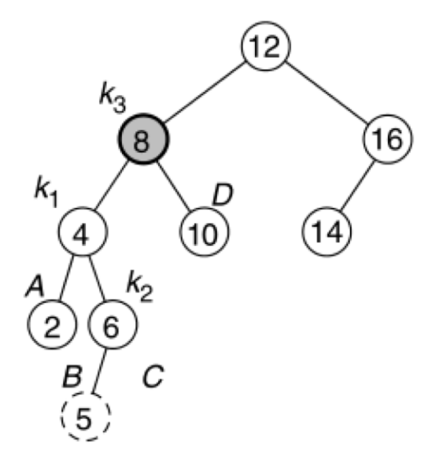

# AVL Trees (Part 1)

## Review: Binary Search Trees

+ Store a collection of sorted values
  + Left subtree < parent < right subtree
  + No duplicates
+ Basic operations
  + Search for a value
  + Insert a value
  + Remove a value
  + Big-$O$ analysis

## Binary Search Tree: Big-$O$

+ Search/insert/remove: runtime complexity $O($height$)$
  + Worst case: $O(n)$ with degenerate trees
  + Best case: $O(\log_2(n))$ with balanced trees

{ width=50% }

## Balancing Trees

+ Self-balancing binary search trees
  + Prevent degenerated trees by keeping the tree balanced
  + Need re-balancing on `insert(T t)` or `remove(T t)`
  + Need to maintain additional properties beyond being a search tree
+ Several kinds of trees do this
  + AVL: the left and right subtree height differs by no more than $1$
  + Red-black: preserve $4$ red/black node properties
  + B-trees: the generalized version with $m$ children (we'll revisit this later in the semester)
  + AA: a red-black tree where all the left nodes are black
  + Splay: a tree where recently accessed elements are faster accessed than less recently accessed elements

## AVL Trees

+ The AVL tree is named after its two inventors, Georgy Adelson-Velsky and E.M. Landis, who published it in their 1962 paper "An algorithm for the organization of information"
+ Definition: an AVL tree is a balanced binary search tree. For any `Node n` in an AVL tree:
  + `n.left` and `n.right` differe in height by at most `1`
  + The leaf node has a height `0`
  + `null` (the empty subtree) has a height of `-1`
+ AVL tree is a self-balancing tree
  + Make adjustments at insertion/removal to keep the tree balanced

## Exercise: Spot the AVL Trees

{ width=75% }

+ **TODO: LIST THE AVL TREES**

## AVL Trees: Balancing

+ Track the balance factor of tree nodes
  + `balance = height(n.left) - height(n.right)`
  + Must be `-1`, `0`, or `+1` for it to be an AVL tree
    + If it is any other value, we must perform rotations in the tree
+ Key idea: track and adjust the balance on `insert(T t)` or `delete(T t)`
  + Recursively add or remove a node
  + Unwind the recursion up to adjust the balance of the ancestors
    + Observation: only nodes along the path from changing point to root may need to (potentially) be balanced
  + When unbalanced, rotate to adjust heights
    + Rotation changes structure of tree without affecting ordering
    + Might need single or double rotation

## AVL Tree Insertion

+ Start the same as a normal binary search tree insertion
+ When a node is added too deep, the balance is broken
  + We need to fix the broken cases with rotation

## Single Rotations Basics

+ Right rotation
  + The left child becomes the new root, and the old root becomes the right child

{ width=50% }

+ Left rotation
  + The right child becomes the new root, and the old root becomes the left child

{ width=50% }

## Single Rotation to Fix

{ width=50% }

## Re-Balancing with a Single Rotation

{ width=50% }

+ Why does this work?
  + {node in A} $< k_1 <$ {node in B} $< k_2 <$ {node in C}
  + The height difference is reduced

~~~java
// Single Right rotation
Node<T> rightRotate(Node<T> t) { // t is the old root, k_2
  Node<T> newRoot = t.left; // promote k_1
  t.left = newRoot.right;   // k_2 takes over B as the left child
  newRoot.right = t;        // k_1 takes over k_2 as the right child
  t.height = Math.max(t.left.height, t.right.height) + 1; // update the height
  newRoot.height = Math.max(newRoot.left.height, newRoot.right.height) + 1;
  return newRoot;
}
~~~

## Practice

### Example 1

+ Insert 40
+ Which node(s) need(s) to be re-balanced?
+ How do we re-balance it?

{ width=50% }

### Example 2

+ Insert 85
+ Which node(s) need(s) to be re-balanced?
+ How do we re-balance it?

{ width=50% }

## Multiple Rotation Basics

+ Sometimes a single insertion isn't enough

{ width=25% }

+ Here we insert 5
+ The AVL tree is now unbalanced -- how do we fix it?
  + Rotation like before doesn't work:

{ width=50% }

+ The tree keeps the same height difference that it had before the rotation
+ How can we fix this?
  + With double rotations!

## Left-Right Double Rotation

+ Left rotate $(k_1, k_2)$
+ Right rotate $(k_3, k_2)$

{ width=50% }

## Double Rotation Example

+ Insert 5
  + The problem is at 8: the left and right heights differ by 2
    + Left rotate 4 (the height imbalance remains)
    + Right rotate 8 (the height imbalance is fixed)

{ width=50% }