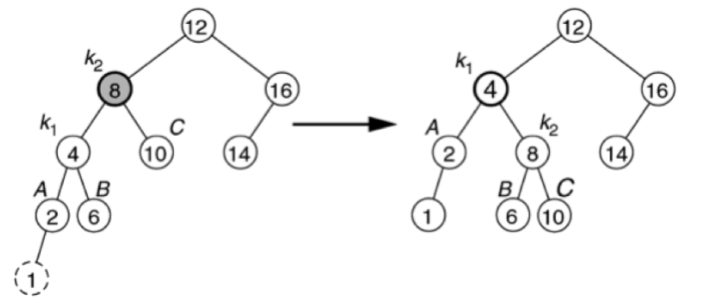
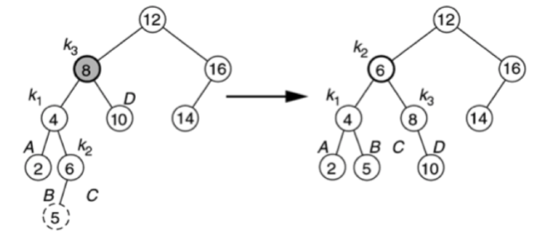
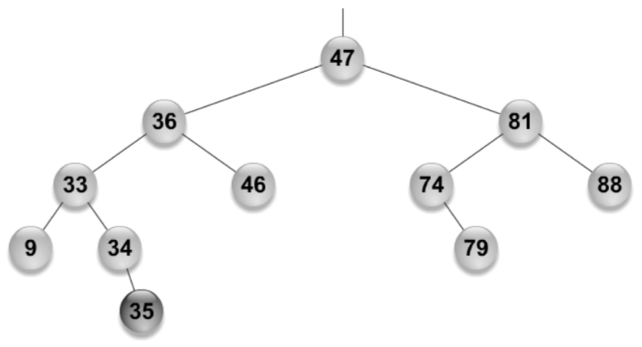

# AVL Trees (Part 2)

## Review: AVL Trees

+ Binary search tree with balance property
+ Re-balancing might be triggered by insertion into or removal from the tree
  + Check the height of the left and right sub-trees and keep the difference bounded by 1
  + Might require a single or a double rotation

## AVL Tree Balance Cases

+ Height imbalance means some node `n` whose two sub-trees differ by two
  + Case 1: Insertion into the left subtree of the left child or `n`
  + Case 2: Insertion into the right subtree of the left child or `n`
  + Case 3: Insertion into the left subtree of the right child or `n`
  + Case 4: Insertion into the right subtree of the right child or `n`
+ Note the symmetry between cases 1 and four and cases 2 and 3
  + Cases 1 and 4 take place on the outside of the tree and require only a single rotation
  + Cases 2 and 3 take place inside the tree and require a double rotation
+ Similar cases when a deleiton causes an imbalance

## Case Examples

{ width=50% } { width=50% }

## Left-Right Rotation Code

The following code comes from our book by Weiss, Figures 19.24, 19.27, 19.32, and 19.33.

~~~java
/**
 * Rotate binary tree node with left chid.
 * For AVL trees, this is a single rotation for case 1.
 */
static BinaryNode rotateWithLeftChild( BinaryNode k2 ){
  BinaryNode k1 = k2.left;
  k2.left = k1.right;
  k1.right = k2;
  return k1;
}

/**
 * Rotate binary tree node with right child.
 * For AVL trees, this is a single rotation for case 4.
 */
static BinaryNode rotateWithRightChild( BinaryNode k1 ) {
  BinaryNode k2 = k1.right;
  k1.right = k2.left;
  k2.left = k1;
  return k2;
}

 /**
  * Double rotate binary tree node: first left child
  * with its right child; then node k3 with new left child.
  * For AVL trees, this is a double rotation for case 2.
  */
static BinaryNode doubleRotateWithLeftChild( BinaryNode k3 ) {
  k3.left = rotateWithRightChild( k3.left );
  return rotateWithLeftChild( k3 );
}

 /**
  * Double rotate binary tree node: first right child
  * with its left child; then node k3 with new right child.
  * For AVL trees, this is a double rotation for case 3.
  */
static BinaryNode doubleRotateWithRightChild( BinaryNode k1 ) {
  k1.left = rotateWithLeftChild( k1.right );
  return rotateWithRightChild( k1 );
}
~~~

+ What's our complexity?
  + Each method is $O(1)$ and even with composition the result is still $O(1)$

## Practice

{ width=50% }

+ Assume that we just inserted 35 into the above tree
+ Which node(s) do we need to re-balance?
  + **ANSWER**
+ How do we re-balance them?
  + **ANSWER**

## Excerpt of Insertion Code

**Use method names that are equivalent to the above methods taken from the textbook**

~~~java
private AvlNode insert( Comparable x, AvlNode t ) {
  // Insertion
  if (t == null) {
    // Found the spot to insert; return new node with data
    t = new AvlNode( x, null, null );
  } else if ( x.compareTo( t.element ) < 0) {
    // Head to left recursively
    t.left = insert( x, t.left );
  } else {
    // Head to right recursively
    t.right = insert( x, t.right );
  }

  // Check balance and rotate
  if (height(t.left) - height(t.right) == 2) {
    // Left subtree is deeper than right subtree
    if (height(t.left.left) > t.left.right) {
      // Outer tree unbalanced; single rotation
      t = rightRotate( t );
    } else {
      // the inserted node went left-right; double rotation
      t = leftRightRotate( t );
    }
  } else {
    // Symmetric cases for the right subtree being deeper than the left
  }

  // Return the new root
  return t;
}
~~~

## AVL Deletion

+ Start with our normal BST deletion
  + 0 children (node is a leaf): delete the node
  + 1 child: delete the node and connect the child to the parent
  + 2 children: put the predecessor/successor to replace the node, then delete the predecessor/successor
+ Which nodes should we check for an imbalance?
  + 0 children / 1 child: all nodes on the path from the deleted node to the root
  + 2 children: all nodes on the path from the deleted predecessor/successsor to the root

## AVL Deletion Imbalance Cases

+ `n` is the node with the imbalanced heights
  + Deleting from the right subtree of `n`
    + The left subtree of a left child is too tall: outside case, single rotation
    + The right subtree of a left child is too tall: inside case, double rotation
    + Both subtrees of the left child are too tall: same as the first case
  + Symmetric cases for deleting from the left side
    + Right subtree of a right child is too tall: outside case, single rotation
    + Left subtree of a right child is too tall: inside case, double rotation
    + Both subtrees of a right child are too tall: same as the first case

## Complexity

**Proposition**: maintaining the AVL balance property during insertion and removal will yield a tree with $N$ N nodes and height $O(\log(N))$

**Theorem 19.3**: An AVL tree of height $H$ has at least $H_{H+3} - 1$ where $F_i$ is the $i$th Fibonacci number
  
**Proof**: Let $S_H$ be the size of the smallest AVL tree of height $H$. Clearly, $S_0 = 1$ and $S_1 = 2$. The smallest AVL tree of height $H$ must have subtrees of height $H – 1$ and $H – 2$. The reason is that at least one subtree has height $H – 1$ and the balance condition implies that subtree heights can differ by at most $1$. These subtrees must themselves have the fewest number of nodes for their heights, so $S_H = S_H – 1 + S_H – 2 + 1$. The proof can be completed by using an induction argument.

*Corollary*: We know that $F_i \approx \frac{\varphi^i}{\sqrt{5}}$ where $F_i$ is the $i$th Fibonacci number and $\varphi = \frac{1+\sqrt{5}}{2} \approx 1.618$. Then with an AVL tree of height $H$ we have at least $\frac{\varphi^{H+3}}{\sqrt{5}}$ nodes, and its depth is at most logarithmic. The height of an AVL tree satisfies

$$H < 1.44 \log(N+2) - 1.328.$$

Therefore the worst-case height is at most roughly $44\%$ more than the minimum possible for binary trees.

*Corollary*: All searching operations in an AVL tree have logarithmic worst-case bounds.

*Note*: The depth of an average node in a randomly constructed AVL tree tends to be very close to $\log(N)$. The exact answer has not yet been established analytically. We do not even know whether the form is $\log(N) + C$ or $(1 + \epsilon) \log(N) + C$, for some $\epsilon$ that would be approximately $0.01$. Simulations have been unable to demonstrate convincingly that one form is more plausible than the other.

## Rotation Overhead

+ Single rotation / double rotation once
  + $O(1)$ complexity
+ How many rotations are needed for
  + Insertion: 2 (worst-case double rotation), which is $O(1)$
  + Removal: 2 (worst-case double rotation), which is $O(1)$
+ Overall complexity
  + Bounded by $O($height$) = O(\log_2(N)$

## Next Lecture

+ Topic: more self-balancing binary search trees
  + Red-black trees
+ Reading: Chapter 19.5 - 19.7