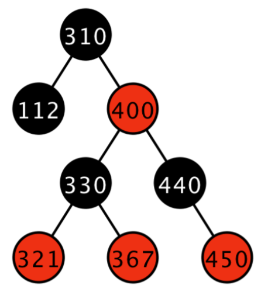
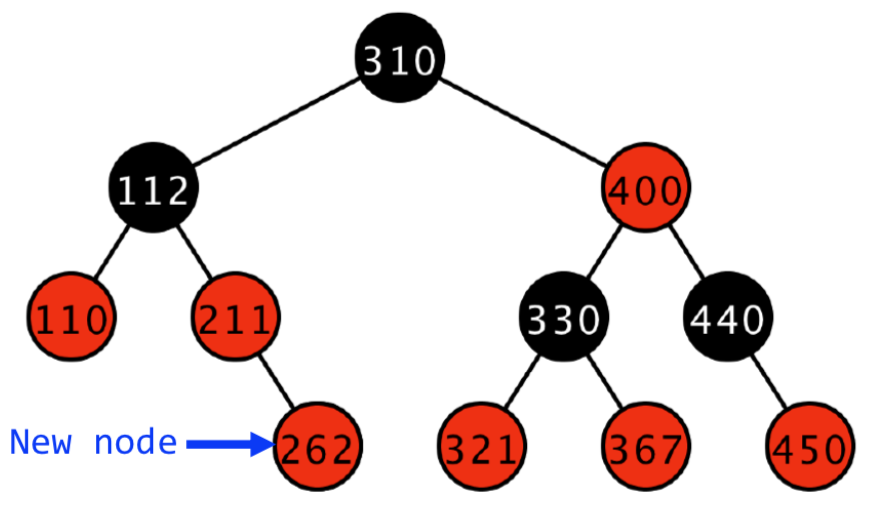
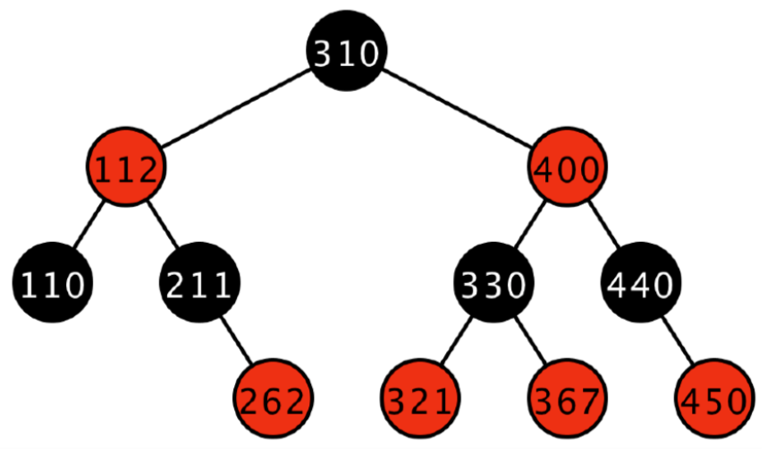
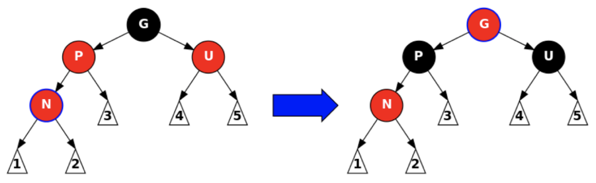
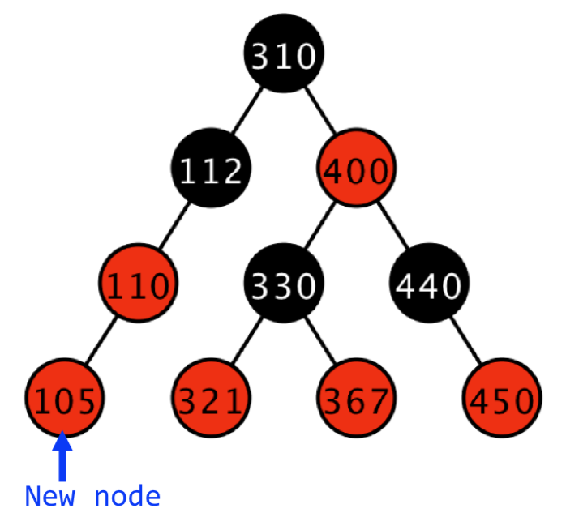
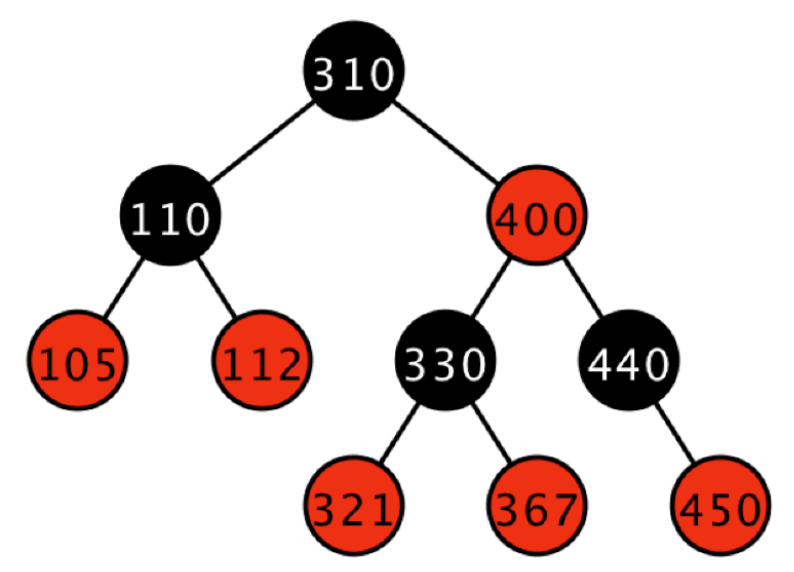
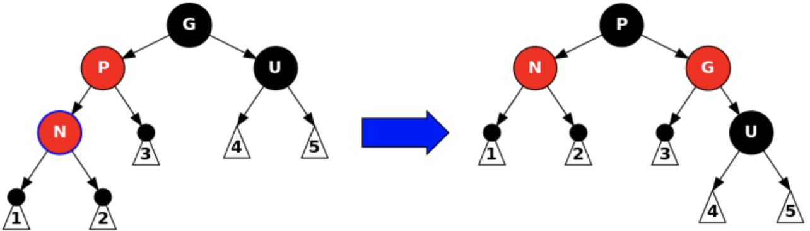
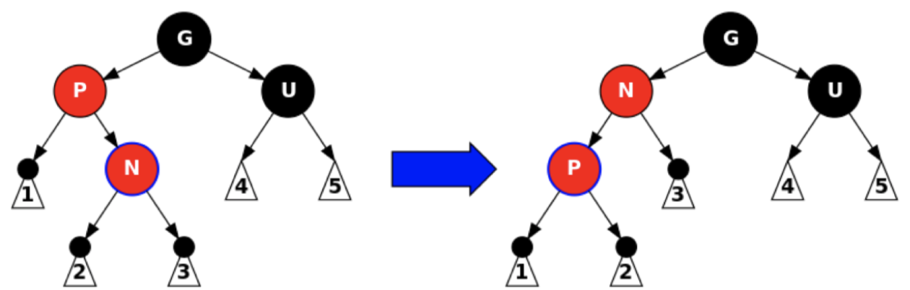

# Red-Black Trees (Part 1)

## Review

+ Binary search tree with self-balancing features
  + AVL trees
    + Definition: binary search tree with a balanced height
    + Operation and analysis
      + Single or double rotations

## Red-Black Trees

+ In a 1978 paper "A Dichromatic Framework for Balanced Trees", Leonidas J. Guibas and Robert Sedgewick derived red-black tree from symmetric binary B-tree. The color "red" was chosen because it was the best-looking color produced by the color laser printer.." (Wikipedia:Red-black tree)
+ Could perform insertion in a single top-down pass
  + AVL trees require one pass down for insertion, and a second pass upwards to update the height and re-balance
+ Red-black trees
  + Definition: four features
  + Operation: insertion
  + Analysis: how can we ensure a height of $\log(N)$?

## Red-Black Tree Definition

+ A binary search tree with four additional properties
  1. Every node is either red or black
  2. The root is black
  3. If a node is red, its children are black -- the converse is *not necessarily true*
  4. Every path from the root to `null` has the same number of black nodes

## Red-Black Trees vs AVL Trees

+ Both are special binary search trees

{ width=25% }

+ Is this a red-black tree?
  + Yes:
    1. Every node is either red or black
    2. The root is black
    3. If a node is red, its children are black
    4. Every path from the root to `null` has the same number of black nodes: 1
+ Is this an AVL tree?
  + No, because there is a difference of more than one between the left and right subtrees

## Insertion Basics

+ Implementations tend to use recursion for clarity (though it's still more complicated than the implementation for insertion in an AVL tree)
+ Insert data as if it were a normal binary search tree
  + Color the new node red and insert it as a leaf **(why red?)**
  + If this creates two adjacent red nodes, fix it
  + Fix all red-red child-parent pairs using rotations or recolors

## Easy Case

{ width=25% }

+ Inserting $110$ or $211$
  + With a black parent node: easy
  + No two adjacent red nodes
  + The same black depth for all nodes with a `null`-child including the new node
  + Black depth of a node: the number of black nodes from root to that node

## Recolor Case

{ width=50% }

+ Inserting $262$
  + The new node has a red parent and a red uncle (they are *not* `null`)
  + Grandparent must be black
  + Recolor the grandparent, parent, and uncle (red-black-black)
    + After this point, we'll need to check the grandparent and make sure that we haven't messed up the supertree

{ width=50% }

## Recolor Up the Tree

+ The general case of a red parent and red uncle:
  + After recoloring, the grandparent becomes red and might conflict with the newly inserted node's red great-grandparent

{ width=75% }

## Rotation Case

{ width=35% }

+ Insert $105$
  + New node with a red parent and a black uncle
    + The `null` child of $112$ is considered black
  + Can we recolor the grandparent to red and the parent to black?
    + Nope!
    + The `null` child of $112$ would have a changed black depth!
  + Then we must use a rotation and a recolor
    + Right-rotate $110$ recoloring it black, and recolor $112$ as red

{ width=40% }

## Rotation General Cases

+ The new node is red, the parent is red, and the uncle is black
  + Note: more black on the uncle's side of the tree
+ Step 1: perform a rotation at the parent *if needed*
  + **When do we do this? Why?**

{ width=75% }

+ Step 2: perform a rotation at the grandparent
+ Step 3: swap the old parent and the grandparent's colors

{ width=75% }

## Red-Black Tree Insertion Notes

+ Cases have mirror cases (the right side cases are all mirrors of the left side which we've already discussed)
  + Before you ask: cases don't have an agreed upon numbering
+ Use the Gnarley Trees demo (`gt.jar`) to play around with the trees