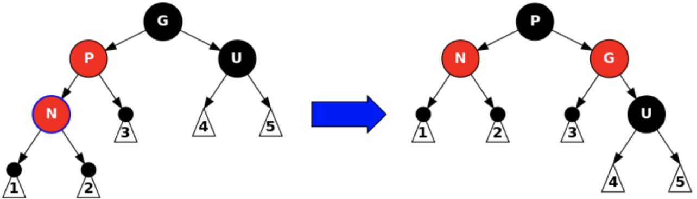
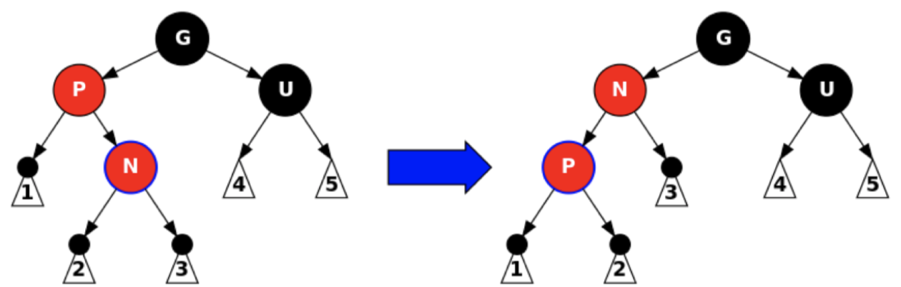
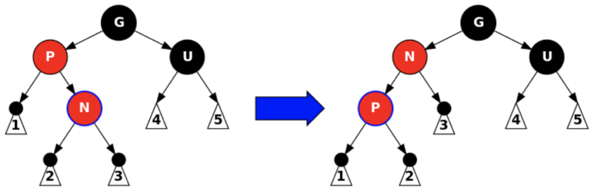
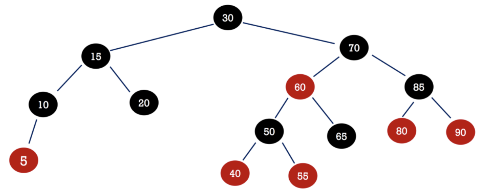
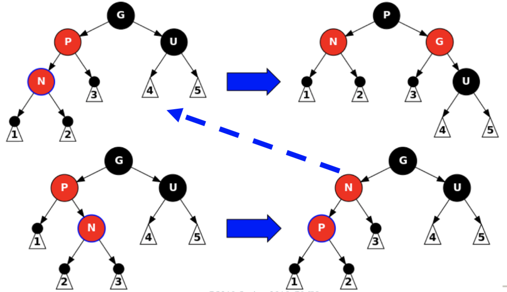
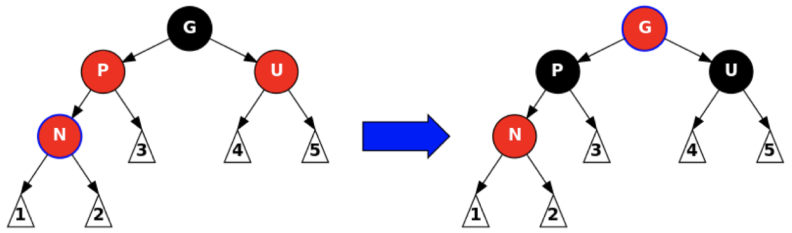
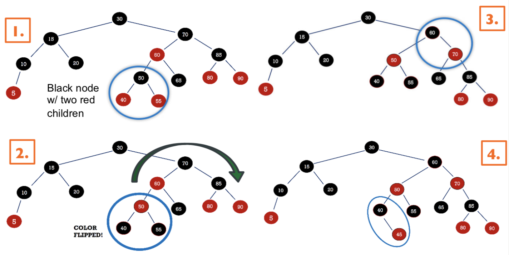

# Red-Black Trees (Part 2)

## Review

+ Color properties
+ Insertion: add new values as a red leaf
  + Black parent
  + Red parent and red uncle
    + Recoloring
  + Red parent and black uncle
    + Rotation and recoloring

## Rotation General Cases

+ The new node is red, the parent is red, and the uncle is black
  + Note: more black on the uncle's side of the tree
+ Step 1: perform a rotation at the parent *if needed*
  + **When do we do this? Why?**

{ width=75% }

+ Step 2: perform a rotation at the grandparent
+ Step 3: swap the old parent and the grandparent's colors

{ width=75% }

+ We could potentially need an additional step in certain cases
  + Consider the case where we need to use a left-rotation with the newly inserted node

{ width=75% }

## Problems with Red Subtree Roots

+ Remaining issue: if a recolor makes a subtree root red, then we may have create two consecutive red nodes!
+ Strategy one: detect and travel back up to perform additional fixes
  + We can always change the root to black for a final fix
  + We do however have to go up to fix the nodes with rotation or recoloring

## Example

+ Suppose we want to insert $45$ into the following red-black tree.

{ width=100% }

+ Trying to do so would land us with a red-red combo, where the uncle is also red
  + As such, we'd need to recolor them
  + This requires (possibly) more rotations and recoloring up the tree

## Top-Down Approach

+ Strategy two: down only (top-down insertion)
  + In a single downwards pass, recolor and rotate to ensure that the insertion will succeed without us having to walk back up the tree to fix it afterwards
+ What might cause trouble for us so that we need to go back up the tree to fix it?
  + Black parent: easy, no issue there
  + Red parent
    + **Black uncle?**
    + **Red uncle?**

## Black Uncle

{ width=100% }

## Red Uncle

{ width=100% }

## Top-Down Insertion

+ The fix: guarantee that the red parent does not have a red sibling
  + One the way down we need to check the (black) node `n`
  + If both children are red, chang ethe children to black and change `n` to red
    + **What if `n` is the root?**
  + If the parent of `n` is red, use a single/double rotation and recoloring to fix, then continue down the tree
    + **Can `n` have a red uncle?**
  + Ensure that after the red inserction, we only need to perform local adjustments
    + There is no percolating back up

## Example (Continued)

+ Back to our previous example of trying to insert $45$ into a red-black tree:

{ width=100% }

## Complexity

+ A red-black tree which contains $n$ nodes has a height of $O(\log(n))$
  + A detailed proof is available on [Wikipedia's Red-Black Tree page](http://en.wikipedia.org/wiki/Red%E2%80%93black_tree)
+ Notes
+ The black height (`bh`) of a node `m` counts the number of black nodes from `n` to a `null` link (not counting `t` if `t` is black)
  + Given `bh(t)`, the shortest path from `n` to any `null` link has `bh(t)` edges: all of which are black nodes
  + Given `bh(t)`, the longet path from `t` to any `null` link has `2 * bh(t)` edges: the nodes alternate between red and black
  + `bh(t) >= h(t) / 2`, where `h(t)` is the height of `t` where `h(null) = 0
  + The height of a nod `t`: `h(t)` is bounded above by `2 * bh(t)`
  + Number of nodes rooted at `t`: bounded below by `2^bh(t) - 1 <= N`
    + Proof by induction on `height` and `bh`
  + `h(t) <= 2 log(2, N + 1)` where `N` is the size of the tree

## AVL Trees vs. Red-Black Trees

### AVL Trees

+ Pros
  + Simple(r) to implement
  + Faster lookup (maintains optimal height)
+ Cons
  + Slower to insert or delete (because it must maintain optimall height)
  + Simple implementation is recursive and relies on down-up toslutions

### Red-Black Trees

+ Pros
  + Faster insert/delete (doesn't have to maintain optimal height)
  + Implementation tricks can do down-only insertion and deletion
+ Cons
  + Complex algorithm
  + Slower lookup (doesn't have optimal height)
  + Implementation is complicated

## Balanced BST Benefits

+ Keep data in order
+ Provided guarantee $O(\log(N))$ find/add/remove
+ Reproduce sorted order via an in-order traversal
+ Reproduce sorted slices of data
  + Locate a record in $O(\log(N))$ time
  + In-order traversa from that record

## Sets and Maps Review

+ Closely related data structures
  + A collection of (usually distinct)  values
  + Supports efficient look-up
    + Do we have this value or not?
    + Is there a value associated with this key>
+ Conventions:
  + Do not allow keys to be null
  + Do not allow duplicate values for a key
    + `put(key1, val1)` followed by `put(key1, val2)` sees `val2` overwrite `val1`
  + Iteration is allowed on the keys
    + We can the use the key to get the associated value

## Maps and Sets Implementations

+ Main concern: can we efficiently handle a large number of `get` operations after a large number of `put` or `get` operations?
+ Naive implementations
  + Unordered linked list
  + Ordered array
+ Trees
  + Binary search trees
  + Balanced binary search trees (AVL, Red-Black, AA)
+ Hash tables

## Maps and Sets Big-$O$

Implementation  | Worst Case | Worst Case | Average Case | Average Case | Ordered | Remarks |
:-------------: | :--------: | :----------: | :-----: | :-----: | :----: | :----: |
| | Search | Insert | Search | Insert | |
Unordered List | $O(n)$ | $O(n)^1$ | $O(n)$ | $O(n)^1$ | no | |
Ordered List | $O(\log(n))$ | $O(n)$ | $O(\log(n))$ | $O(n)$ | yes | |
HT Chaining | $O(n)$ | $O(n)$ | $O(n/m)$ | $O(n/m)$ | no | often used$^2$ |
HT Probing | $O(n)$ | $O(n)$ | $O(1)$ | $O(1)$ | no | |
BSTs | $O(n)$ | $O(n)$ | $O(\log(n))$ | $O(\log(n))$ | yes | easy |
AVLs | $O(\log(n))$ | $O(\log(n))$ | $O(\log(n))$ | $O(\log(n))$ | yes | easy |
Red-Black Trees | $O(\log(n))$ | $O(\log(n))$ | $O(\log(n))$ | $O(\log(n))$ | yes | often used$^2$ |

+ $n$: number of values
+ $m$: number of entries
+ $^1$: $O(n)$ to check for duplicates, $O(1)$ if this is not needed for some reason
+ $^2$: Good constants and relatively easy to implement; used in many libraries

## Next Lecture

+ Disjoint sets: union/find
+ Reading: Chapter 24