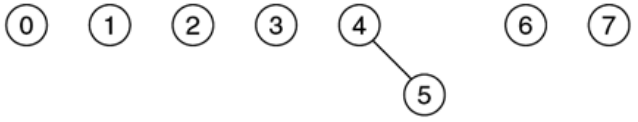
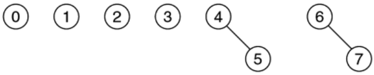
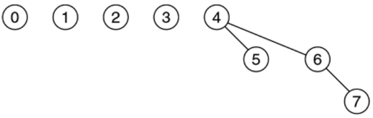
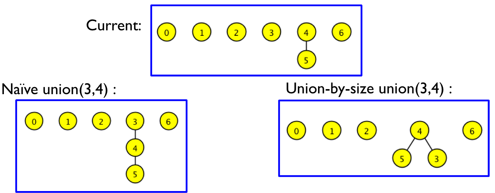
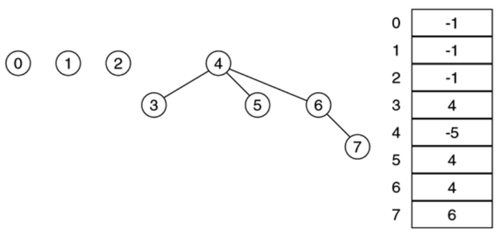

# Disjoint Sets and Union Find (Part 1)

## Review: Sets

+ *Set*: a collection of distinct objects
  + No duplicates
  + Order does not matter
+ Set operations
  + Intersection, union, complement, etc.
+ Set relationships
  + Subset (proper subset), superset (proper superset)
  + Testing for the property of being disjoint

### Example

+ Consider the following sets:
  + $A = \{1, 2\}$
  + $B = \{3, 4\}$
  + $C = \{8, 1\}$
+ What is $A\cup B$?
  + $A\cup B = \{1, 2, 3, 4\}$
+ What is $A\cap C$?
  + $A\cap C = \{1\}$
+ Which sets are disjoint?
  + $A\cap B = \emptyset$
  + $B\cap C = \emptyset$
  + $A\cap C = \{1\}$
  + So sets $A$ and $B$ are disjoint and sets $B$ and $C$ are disjoint

## Disjoint Sets

+ A new data structure (hurrah!)
+ A collection of $n$ sets in which any two contain no common elements
  + Written formally:
  $$
  (\forall i, j \in \{1 \dots n\} \land i \neq j) (A_i \cap A_j = \emptyset)
  $$
+ Basic operations:
  + *Find*: given an element, return the set it belongs to
    + Note, it can belong to at most one set
  + *Union*: merge two sets into one
    + Note: the union of two disjoint sets is still pairwise disjoint with all other sets, excluding the components of the union

## Disjoint Sets Example

+ Consider the following sets:
  + $A = \{1, 2\}$
  + $B = \{3, 4\}$
  + $C = \{8\}$
+ Example operations:
  + find$(2) = A$
  + union$(a, b) =$ union$(a, b) = \{1, 2, 8\}$
    + Take the union of the two sets $A$ and $B$ such that $a\in A$ and $b\in B$
    + After the union, find$(2) =$ find$(8)$
    + After the union, there are only two sets in the collection: $A\cup B$ and $C$

## Disjoing Sets: Union Find

+ *Disjoint Set*: a collection of sets that are all disjoint
  + How can we represent this data structure?
    + Possibly with a tree?
  + Note the special features of this structure:
    + The union of all sets remains the same
    + The intersection of any two sets is always empty
+ We only need to support two operations on this structure
  + `find()` -- how could we implement this function?
  + `union()` -- how could we implement this function?
+ Quick find approach
+ Quick union approach

## Simple Solution: Set of Sets

+ Organize the collection as a set of sets
+ Each set is implemented using a normal set data structure, like a hash set, a binary search tree, etc.
+ Operations:
  + `find(T t)`: search for `t` in every set
  + `union(T a, T b)`: assume that $a\in A$ and $b\in B$; add everything in $B$ to $A$ and discard $B$
+ Do we really need a hash set or a binary search tree for `find` or `union`?

## Quick Find Approach

+ Number each item from $0$ to $n-1$
+ Maintain an array of $n$ elements
  + Store the set that element $i$ belongs to in `arr[i]`
+ The complexity of find is trivial and $O(1)$
+ What's the complexity of `union`?

  item @ $i$ | $0$ | $1$ | $2$ | $3$ |
  :--------: | :-: | :-: | :-: | :-: |
  `arr[i]`   | $A$ | $B$ | $C$ | $A$ |

+ Corresponds to the disjoint sets $A = \{0, 3\}, B = \{1\},$ and $C = \{2\}$
+ As an example, suppose that $i\in A$ and $j\in B$, with $A \neq B$
  + Find all items in $B$, change ownership to $A$, and remove $B$
  + What's the complexity of this example?
    + $O(n)$
+ After `union(0, 1)`: $A = \{0, 3, 1\}, C = \{2\},$ and $B$ does not exist
  
  item @ $i$ | $0$ | $1$ | $2$ | $3$ |
  :--------: | :-: | :-: | :-: | :-: |
  `arr[i]`   | $A$ | $A$ | $C$ | $A$ |

## Quick-Find: Union

+ The complexity of a single `union` is $O(n)$
+ How many unions do we need for situations like maze generation
  + $n-1$, total time complexity is $O(n^2)$
+ Can we improve the efficiency of the `union` if `find` isn't a concern?
  + Elements of the same set in one linked list?
  + Elements of the same set in one tree?

## Quick Union with Trees

+ Keep all elements of the same set in one tree
  + Represent the set with the tree root
+ We continue to number each item $0$ to $n-1$ and maintain an array of $n$ elements
  + Store the parent of element $i$ in `arr[i]`
  + If element $i$ is the root, `arr[i] = -1`
  + `find(i)` returns the root of the tree that $i$ belongs to
+ As an example, consider the following collection of eight disjoint sets: $\{0\}, \{1\}, \{2\}, \{3\}, \{4\}, \{5\}, \{6\}, \{7\}$
  + We would represent this as a forest of eight trees, each containing only a root
  + Then `find(i) = i`
  + The array representation would be
  
$i$ | `arr[i]` |
:-: | :------: |
$0$ | $-1$     |
$1$ | $-1$     |
$2$ | $-1$     |
$3$ | $-1$     |
$4$ | $-1$     |
$5$ | $-1$     |
$6$ | $-1$     |
$7$ | $-1$     |

## Tree Representation

+ *Union*: merge two trees
  + (Naive) union$(r_1, r_2)$: Let $r_1$ and $r_2$ be the roots of two trees; add $r_2$, as a child, to $r_1$ -- then $r_1$ is the new root of the merged tree
  + union$(i, j)$: for any element $i$ and $j$, is equivalent to union$(r_1, r_2)$
+ *Find*: walk up the tree until the root is reached and report the ID of the root

## Tree: Union-Find Example

Here, we use the same collection of eight disjoint sets that we used in [Quick Union with Trees](#Quick-Union-with-Trees).

+ union$(4, 5)$
  + Graphical representation:

    { width=50% }

  + Tabular representation:

    $i$ | `arr[i]` |
    :-: | :------: |
    $0$ | $-1$     |
    $1$ | $-1$     |
    $2$ | $-1$     |
    $3$ | $-1$     |
    $4$ | $-1$     |
    $5$ | $4$      |
    $6$ | $-1$     |
    $7$ | $-1$     |

+ union$(6, 7)$
  + Graphical representation:

    { width=50% }

  + Tabular representation:

    $i$ | `arr[i]` |
    :-: | :------: |
    $0$ | $-1$     |
    $1$ | $-1$     |
    $2$ | $-1$     |
    $3$ | $-1$     |
    $4$ | $-1$     |
    $5$ | $4$      |
    $6$ | $-1$     |
    $7$ | $6$      |

+ union$(4, 7)$
  + Graphical representation:

    { width=50% }

  + Tabular representation:

    $i$ | `arr[i]` |
    :-: | :------: |
    $0$ | $-1$     |
    $1$ | $-1$     |
    $2$ | $-1$     |
    $3$ | $-1$     |
    $4$ | $-1$     |
    $5$ | $4$      |
    $6$ | $4$      |
    $7$ | $6$      |

## Practice One

+ Start with 10 one-element sets (so 10 single-node trees)

  $0$ | $1$ | $2$ | $3$ | $4$ | $5$ | $6$ | $7$ | $8$ | $9$ |
  :-: | :-: | :-: | :-: | :-: | :-: | :-: | :-: | :-: | :-: |
  $-1$| $-1$| $-1$| $-1$| $-1$| $-1$| $-1$| $-1$| $-1$| $-1$|

+ Try union$(1, 2)$, union$(8, 6)$, find$(6)$, and find$(1)$
+ Then try union$(8, 7)$, union$(2, 4)$, union$(3, 6)$, and find$(6)$
+ Draw the trees and fill the table

## Practice Two

+ Start with 10 one-element sets (so 10 single-node trees)

  $0$ | $1$ | $2$ | $3$ | $4$ | $5$ | $6$ | $7$ | $8$ | $9$ |
  :-: | :-: | :-: | :-: | :-: | :-: | :-: | :-: | :-: | :-: |
  $-1$| $-1$| $-1$| $-1$| $-1$| $-1$| $-1$| $-1$| $-1$| $-1$|

+ Try union$(1, 2)$, union$(3, 1)$, union$(5, 2)$, and union$(6, 3)$
+ Draw the trees and fill the table

## Complexity

+ `find`
  + Walk backwards until the root is encountered
  + So it's $O($height$)$
  + Worst case is then $O(n)$
+ `union`
  + $O(1)$ if the root is already known
  + $O(n)$ including the time to find the root
+ How can we improve the efficiency of these methods?

## Complexity As of Now

+ Worst case scenarios with $n$ initial sets
  
Approach      | Union  | Find   |
:-----------: | :----: | :----: |
Set of sets   | $O(n)$ | $O(n)$ |
Quick find    | $O(n)$ | $O(1)$ |
Tree (naive)  |$O(1)^*$| $O(n)$ |

+ $^*$: if the roots are given; if the roots are not given, then $O(n)$ time since we must find the root

## Improved Union

+ Idea: we can do union-by-rank
  + Attach the smaller tree to the bigger one (union-by-size)
    + Break the tie by using the root of the first element as the new root
  + Avoid constructing tall trees

{ width=75% }

+ `arr[i]` representation:
  + Case where $(\geq 0)$: parent of element of $i$
  + Case where $(< 0)$: element $i$ is the root of the tree and the size of the tree is `abs(arr[i])`

{ width=50% }

## Practice Three

+ Start with 10 one-element sets (so 10 single-node trees)

  $0$ | $1$ | $2$ | $3$ | $4$ | $5$ | $6$ | $7$ | $8$ | $9$ |
  :-: | :-: | :-: | :-: | :-: | :-: | :-: | :-: | :-: | :-: |
  $-1$| $-1$| $-1$| $-1$| $-1$| $-1$| $-1$| $-1$| $-1$| $-1$|

+ Using union-by-size, try union$(1, 2)$, union$(3, 1)$, union$(5, 2)$, and union$(6, 3)$
+ Draw the trees and fill the table

## Complexity Revisited

+ Worst case scenarios with $n$ initial sets
  
Approach      | Union  | Find   |
:-----------: | :----: | :----: |
Set of sets   | $O(n)$ | $O(n)$ |
Quick find    | $O(n)$ | $O(1)$ |
Tree (naive)  |$O(n)^*$| $O(n)$ |
Tree (rank union and naive find) | $O(\log(n))^*$ | $O(\log(n))$ |

+ $^*$: includes time to find the root; it's $O(1)$ if the roots are given
