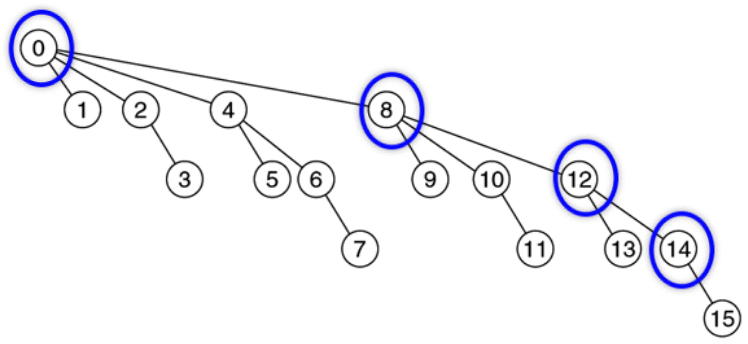
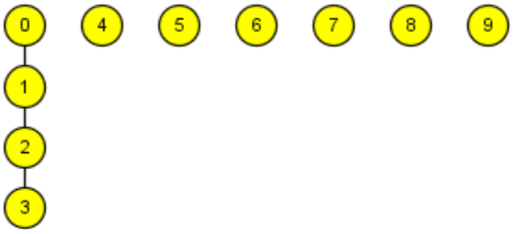
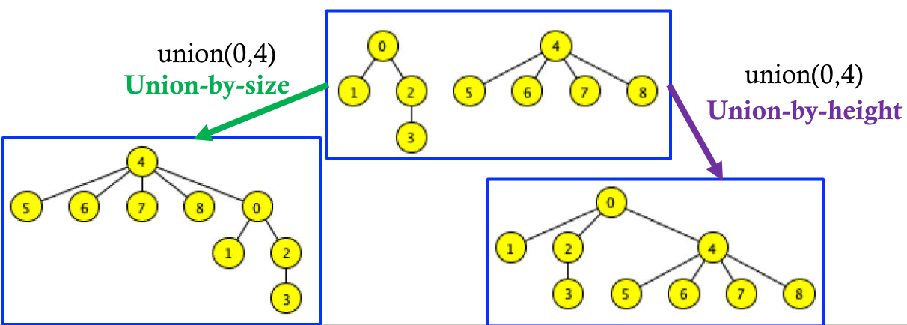

# Disjoint Sets and Union Find (Part 2)

## Improved Find

+ Idea: *path compression*
  + After we perform `find(T t)`, change `t`'s parent to the root
  + Subsequent calls to `find(T t)` (or any node which is in the subtree rooted at `t`) will be faster
  + We can do the same thing to all the nodes from `t` to the root
    + Or... we should at least do it for all the nodes that we visit when we perform `find(T t)`

## Improved Find: Example

{ width=50% }

+ Equal-sized trees when union'd together
  + We call them *binomial trees*
+ The blue circles trace `find(14)`
+ Then after performing path compression, we have the following tree

{ width=50% }

+ Notice how `12` and `14` are now the direct children of `0`, which would speed up subsequent `find` operations that involve either them or their children

## Path Compression in Union

+ Note: for demonstration purposes, assume that we use a naive union and start with a tall tree $\{0,1,2,3\}$

{ width=35% }

+ `union(2, 4)`
  + Remember that `find` is invoked in calls to `union`

{ width=35% }

+ This update occurs after we do `find(2)`, as an intermediate step during the execution of `union(2, 4)`
+ We continue to improve the tree structure so that we have shallower trees after every call to `find` or `union`

{ width=35% }

## Complexity Analysis

+ The analysis is a little different since our speed improves over time
+ Let $n$ be the number of items and initial sets
+ For any sequence of $m$ operations (`union` or `find`)

Implementation | Big-$O$ |
:------------: | :-----: |
Set of sets    | $O(mn)$ |
Quick find     | $O(mn)$ |
Tree (naive)   | $O(mn)$ |
Tree (rank union and naive find) | $O(n + m\log(n))$ |
Tree (naive union and path compression) | $O(n + m\log(n))$ |
Tree (rank union and path compression) | $O(n + m\log(^* n))$ |

+ $log(^* n)$?
  + That's not a footnote!
  + It's defined as the number of times once can apply $n=\log(n)$ until $n\leq 1$
+ Practically speaking, $\log(^* n)$ is equivalent to a constant (since it grows so slowly -- see the table below)
+ So rank union and path compression is approximately $O(n+m)$ for $n$ items and $m$ operations

$n$ | $\log(^* n)$ |
:-: | :----------: |
$1$ | $0$ |
$(1,2]$ | $1$ |
$(2,4]$ | $2$ |
$(4,16]$ | $3$ |
$(16,65536]$ | $4$ |
$(65536,2^{65536}]$ | $5$ |

## Rank Union Variations

+ Union-by-size: attach the smaller of the trees to the larger of the two
  + We keep the root of the bigger tree
  + Easier when used in conjunction with path compression
    + Otherwise it's harder tot rack the height
+ Union-by-height: attach the shorter tree to the taller one
  + We keep the root of the taller tree
  + Easier to use when used alone (that means without path compression)

{ width=75% }

### Building A Maze Example and Blob Detection Example omitted

## Summary: Union Find

+ A collection of disjoint sets
  + `find(T t)` returns the set that `t` belongs to
  + `union(T i, T j)` merges the sets `i` and `j` belong to
+ Implementations
  + Naive
  + Union by rank
  + Path compression
  + Close to linear complexity for the most efficient approaches
+ Applications
+ Mazes
+ MST
+ NCA
+ Vision: blob detection