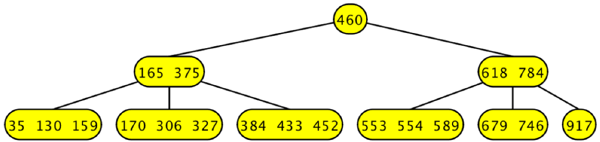
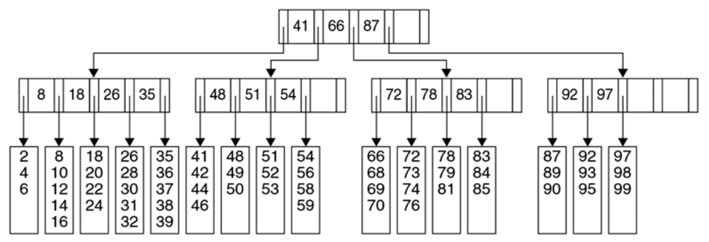

# B and B+ Trees

## Review: Binary Search Trees

+ Stores a collection of sorted values
  + The left subtree is less than the parent which is less than the right subtree
  + There are no duplicates allowed
+ Basic operations
  + Searching through the tree, inserting into the tree, and removing items from the tree
  + All operate in $O($height$)$ of the tree
+ Balanced tree variations
  + AVL and Red-Black trees
  + Operates in $O(\log_2(n))$

## Binary Search Trees

+ So far we have:
  + $n$ as the number of items to store, which is equivalent to the number of tree nodes
  + The tree height (if it's balanced) is usually about $\log_2(n)$
+ How can we improve on this?
  + We can increase the number of branches: let every node have $c$ child noes. The new tree height would be about $\log_c(n)$
  + Combine multiple nodes into one: a single node represents $m$ items. The new tree's size would be $\frac{n}{m}$
  + This in particular is especially helpful when data doesn't fit in memory
    + Dis access is much slower than memory access
    + Breaking up items into size-$m$ groups to transfer from disk to memory is much more efficient

## B-Trees and Variations

+ Commonly used in databases and file systems
  + They were invented by Rudolf Bayer and Ed McCreight while working at Boeing Research Labs in 1972
  + B could stand for: Balanced, Broad, Bushy, Boeing, or Bayer
+ 2-3 trees
  + Every non-leaf node has either two or three children
  + Restricted, simpler version of B-Trees
+ B+ Trees
  + B trees with internal nodes not storing data -- they only store keys
  + Weiss 19.8 presents B+ trees, if you'd like additional reading
+ B$^*$ Trees
  + B+ trees where every non-leaf node is at least $\frac{2}{3}$ full

## 2-3 Trees

+ Every node has between two and three children
  + Nodes are described by the number of children they have
    + A 2-node has two children and a 3-node has three children
+ Every node has between one and two values
  + A non-leaf node with $m$ values must have $m+1$ children
+ Generalized ordering rules between values and subtrees
  + Similar to how we did with BSTs
  + There are also no duplicate values allowed, again, similar to BSTs

## Ordering Examples

{ width=25% } { width=40% }

+ 2-node
  + 1 value (which is $a$) and 2 subtrees ($p$ and $q$)
  + $p < a < q$
+ 3-node
  + 2 values ($a$ and $b$) and 3 subtrees ($p,q$ and $r$)
  + $p < a < q < b < r$

## 2-3 Tree Operations

+ Search: similar to BSTs
+ Insertion: when inserting a new value, the tree grows "upwards"
  + Walk down to add the value into a leaf
  + If the node is too big split it and promote the median to a higher level
    + This could in turn cause a sequence of splitting
+ Deletion: many possible cases
  + Shrinking, merging, and shifting

## B-Trees

+ A B-Tree is a search tree
  + It uses a generalized ordering property
+ A B-Tree of order $m$ requires that for each non-leaf node
  + The number of children is between $\frac{m}{2}$ and $m$
    + Exception: the root has at least two children and is not a leaf
  + The number of values is between $frac{m}{2} - 1$ and $m - 1$
+ The number of values in a leaf node is bounded above by $\ell$
+ Every path from the root to a leaf in a B-tree must have the same length
+ *Note*: a 2-3 tree is a B-tree with $m=3$ and $\ell=2$

## B-Trees vs. BSTs

{ width=75% }

+ Comparison with BSTs
  + They're both search trees, and they're both balanced
  + The smaller height is caused by larger nodes -- this is typically more memory friendly, and B-Trees provide us with the flexibility to tune $m$ and $\ell$ values based on memory configuration
+ Operations are similar to 2-3 trees

## B+ Trees

+ B-Trees in which the nodes store only keys, not data
+ We use those keys to guide the direction of our searches when walking down the tree
+ All values are stored in leaves
  + It's like a tree and an array combined

## B+ Tree Example

{ width=75% }

+ All non-leaf nodes have between 3 and 5 children
  + Which also means that the number of keys is bounded by 2 and 4
+ Each leaf node has between 3 and 5 dta items
  + $\lceil \frac{\ell}{2} \rceil \leq$ number of data items $\leq \ell$
+ *Note*: $m$ and $\ell$ can be different values

## Operations on B+-Trees

+ Search: similar to BSTs
  + Use a group of keys to pick from a group of links to continue searching
+ Insertion: adding a value into a leaf
  + If the leaf isn't full expand the node and insert the keys
  + If the leaf would become full, split the node in two
    + This triggers a recursive process, and we may have to go all the way to the root, splitting than, and add one level to every path
+ Deletion: removing a value from a leaf
  + Remove the value
  + If the node gets too small, we need to merge/adjust with a sibling
  + Similarly, we may need to go all the way to the root and reduce the height of the tree

## B+-Tree Search Examples

Suppose we have the following tree

{ width=75% }

and we want to search for the value `31`. Search proceeds in much the same way that it does in an equivalent BST:

{ width=75% }

+ `31 < 41`, take the leftmost tree
+ `26 < 31 < 35`, take the tree which is second from the right
+ `31` is in the array, so we've found it

Suppose now that we want to find `57`.

{ width=75% }

+ `41 < 57 < 66`, take the tree second to the left
+ `54 < 57`, take the rightmost tree available
+ `57` isn't in the array, so it must not be in the tree

## B+-Tree Insertion Examples

Suppose that we want to insert `57` into the B+-Tree from the previous example. We first find the array in which we will insert `57`:

{ width=75% }

Inserting `57` is as simple as adding it to the array.

{ width=75% }

However, upon a subsequent insertion of a value which would also go into that array, like `55`, we're forced to split the array and add a node to the second half, like so:

{ width=75% }

It's possible that, unlike with the previous example, we don't have room to add a node. In that case, we split the parent.

Consider what happens when we try to add `40` into the tree.

{ width=85% }

The array is already full, so we split the array into equal parts ($[35,37]$ and $[38,40]$). However, there's no place to put the split array, so we have to split the parent.

We push `26` up into the root, and split the parent into two pieces: the first array contains `8` and `18`, and the second array contains `35` and `38`. A valid question at this point is "where did the `38` come from?" Recall that the values of the parent are the base of the array, and that the number of values of the parent are always one less than the number of values in the array. For us to have three arrays attached to the parent, the parent must hold two keys. To get the additional key (since we only had `35` originally) we must take the first value of the array and add that, as a key, to the parent.

Suppose now that we want to delete the value `99` from the tree.

{ width=85% }

The resulting leaf only has two values and its neighbor has three (which is the minimum it is allowed to have). To fix this shortage of values, we can combine the left neighbor and the current leaf to make a new leaf with five values.

However, doing this creates a parent with two children and a single value (`92` -- since `97` is no longer the beginning of the array it is not a key in the parent). To fix *this* problem we can adopt from a neighbor that has more than enough -- we take the array beginning with `83` from the left neighbor, which allows us to make a new value, `87`, giving us two values and three children.

## Operation Ideas

### `add(x, bt)`

~~~ java
find leaf in bt for x
if (space in leaf) {
  add x to leaf
} else {
    if (parent has room) {
      new leaf
      split data
      add x to leaf
    } else {
      recurse up
      split internal
      new leaves
      split data
      back down to add x
  }
}
~~~

### `remove(x, bt)`

~~~ java
find leaf with x
remove x
if (leaf < 1/2 full) {
  merge with neighbor leaf
  steal leaves if needed
  recurse up to adjust
}
~~~

## B-Trees Summary

What should the take home be?

+ Multi-way trees
  + If order-$k$ nodes are all at least $\frac{1}{2}$ full, we have $O(\log_k(n))$ height
+ Hybrids of arrays and trees exist
  + They're sensitive to the memory hierarchy
  + They're good for data that doesn't fit in memory
    + Like large databases, or file systems
+ They are a simple idea but require complex implementations due to the number of cases for supported operations
+ There are many variations on the idea