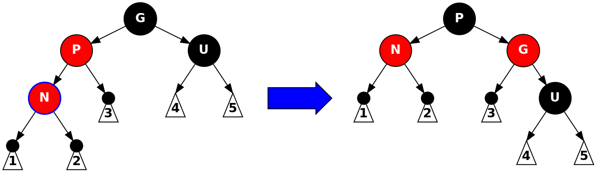

# Final Review

## Reading List Notes and Quick References

+ Big-O:
  + Chapter 5: Algorithm Analysis
  + Section 5.3: You are not required to prove the theorems, but you need to understand them.
+ Lists:
  + Section 6.1-6.3, 6.5: General Lists
  + Chapter 15: Dynamic Array / Array List and Iterator
  + Chapter 17: Linked List
  + Section 6.6: Stack/Queue Concepts
  + Chapter 16.1-16.3: Stack/Queue Implementation
+ Trees:
  + Section 18.1: Tree Basics, Binary Trees
  + Section 7.1-7.3: Recursion
  + Section 18.3-18.4: Tree Recursions, Tree Traversals
+ Hashing:
  + Section 20.1-20.2: Hashing Basics and Hash Functions
  + Section 20.5: Separate Chaining
  + Section 20.3-20.4: Open Addressing
  + Section 20.6-20.7: Comparisons and Applications
+ Graphs:
  + Section 14.1: Graph Basics
  + Section 14.2-14.3: Shortest-path Problem
+ Priority Queues / Heap:
  + Section 6.9: Priority Queues
  + Section 21.1-21.3: Binary Heap
  + Section 21.5: Heap Sort
+ Binary Search Trees:
  + Section 19.1,19.3: Binary Search Tree Basics
  + Section 19.4: AVL Trees
  + Section 19.5: Red-black Trees
  + Section 19.8: B-Trees
+ Disjoint sets:
  + Section 24.1-24.5: Union Find

## Sample Questions for Review

*NB: Questions before the midterm are the same as they were for the midterm review, which makes sense given that the final is cumulative. Since I published a separate midterm review, these questions are omitted here.*

### Hashing (Post-Midterm)

45. Compare and contrast the three types of probing we covered for open addressing. Make sure to note the benefits and disadvantages of each.

Well there aren't really *three* different types of probing -- rather, there's three ways that we can handle collisions. We have separate chaining and open addressing. Open addressing in turn has two different ways of handling collisions, linear probing and quadratic probing. As a chart, we'd have

1. Separate Chaining
2. Open Addressing
   1. Linear probing
   2. Quadratic probing

#### Separate Chaining

The benefit of using separate chaining is that collisions just turn into insertions into some data structure (whether it be a binary tree, another `HashMap`, or something else entirely). Generally separate chaining is preferred. However, that means we need to maintain a separate data structure, have another level of indirection, and adding elements to the data structure may require resizing.

Additionally operations like `add(T t)`, `remove(T t)`, and `contains(T t)` have an upper bound of $O(\log(n))$ since we must search whatever data structure we're using for each entry in the hash table. (Using a second `HashMap` keeps the amortized cost at $O(1)$, while using a binary search tree introduces a cost of $O(\log(n))$, for example).

In class we used a linked list as the secondary data structure, which was kind of silly -- sure it can grow infinitely and is an easy visual to grasp, but the efficiency just isn't there for the operations that we need (fast `add(T t)`, `remove(T t)`, and `contains(T t)`). For Big-$O$ analysis with separate chaining and linked lists, see my notes from February 28, page 3.

#### Open Addressing

Linear and quadratic probing search for the next available space in a hash table instead of creating a data structure to handle collisions. As an example, if slot $5$ is filled, linear probing will check the sequence $\{5+1, 5+2, 5+3, 5+4, 5+5, \dots\} = \{6, 7, 8, 9, 10, \dots\}$ and so on, while quadratic probing will check $\{5+1, 5+2^2, 5+3^2, 5+4^2, 5+5^2, \dots\} = \{6, 9, 14, 21, 30, \dots\}$.

This introduces a need to use tombstones, markers on each entry that indicate whether it has been removed or not, so that we avoid removing entries which are in search chains.

Linear probing suffers from primary clustering since it continually searches within a small neighborhood of cells. Additionally, it has a load of
$$
\frac{1}{2} \left(1 + \frac{1}{(1 - load)^2} \right)
$$
which yields a very steep exponential growth curve for the number of cells checked during an insertion, with respect to the load.

Quadratic probing still needs to use tombstones. However, it doesn't suffer from primary clustering since it checks a more dispersed group of cells. The complexity of quadratic probing isn't known.

A major benefit to use quadratic probing is that if the table size is prime and the load factor stays been 0.5, you are guaranteed to be able to insert and item. Additionally, we get the property that no cell is probed twice.

46. Create a hash function for [strings | numbers | cards | people] which generates relatively unique values.

The wizened people of Oracle have decided on a polynomial hash using base 31, and I see no reason to change the status quo.

Numbers are their own hash functions.

There are 52 cards in a deck, so create a bijection between the cards and the set $\{1, 52\}$. Then the problem reduces to the previous problem involving numbers.

People are (somewhat) uniquely identifiable by their full names, which are in turn strings, so this problem reduces to the first involving strings.

47. Hash [strings | numbers | cards | people] into a hash table of size [some number using [separate chaining | open addressing w/ linear probing | open addressing w/ quadratic probing | open addressing w/ double hashing where `h2(key) = 5 - (key % 5)`] and the hash function you wrote above.

*Omitted.*

48. After hashing the above [strings | numbers | cards | people] remove three of them, making sure to visually indicate any special states.

*Omitted.*

49. Rehash your tables above to [a prime number over double the size].

*Omitted.*

50. Write code for an [add | remove | contains | rehash | getLoad] method in a hash table which uses [separate chaining | open addressing with linear probing | open addressing with quadratic probing | open addressing with double hashing where `h2(key) = 7 - (key % 7)`].

*Omitted -- see textbook.*

51. Explain how Java [String | Integer | Double | Character] class produces hash codes.

#### String

Oracle's release of `String.java` has the following:

~~~java
/**
 * Returns a hash code for this string. The hash code for a
 * {@code String} object is computed as
 * <blockquote><pre>
 * s[0]*31^(n-1) + s[1]*31^(n-2) + ... + s[n-1]
 * </pre></blockquote>
 * using {@code int} arithmetic, where {@code s[i]} is the
 * <i>i</i>th character of the string, {@code n} is the length of
 * the string, and {@code ^} indicates exponentiation.
 * (The hash value of the empty string is zero.)
 *
 * @return  a hash code value for this object.
 */
public int hashCode() {
    int h = hash;
    if (h == 0 && value.length > 0) {
        hash = h = isLatin1() ? StringLatin1.hashCode(value)
                              : StringUTF16.hashCode(value);
    }
    return h;
}
~~~

Taking a look at `StringLatin1.java` reveals

~~~java
public static int hashCode(byte[] value) {
    int h = 0;
    for (byte v : value) {
        h = 31 * h + (v & 0xff);
    }
    return h;
}
~~~

and `StringUTF16.java` similarly shows

~~~java
public static int hashCode(byte[] value) {
    int h = 0;
    int length = value.length >> 1;
    for (int i = 0; i < length; i++) {
        h = 31 * h + getChar(value, i);
    }
    return h;
}
~~~

#### Integer

Oracle's release of `Integer.java` has the following:

~~~java
/**
 * Returns a hash code for this {@code Integer}.
 *
 * @return  a hash code value for this object, equal to the
 *          primitive {@code int} value represented by this
 *          {@code Integer} object.
 */
@Override
public int hashCode() {
    return Integer.hashCode(value);
}

/**
 * Returns a hash code for an {@code int} value; compatible with
 * {@code Integer.hashCode()}.
 *
 * @param value the value to hash
 * @since 1.8
 *
 * @return a hash code value for an {@code int} value.
 */
public static int hashCode(int value) {
    return value;
}
~~~

#### Double

Oracle's release of `Double.java` has the following:

~~~java
/**
 * Returns a hash code for this {@code Double} object. The
 * result is the exclusive OR of the two halves of the
 * {@code long} integer bit representation, exactly as
 * produced by the method {@link #doubleToLongBits(double)}, of
 * the primitive {@code double} value represented by this
 * {@code Double} object. That is, the hash code is the value
 * of the expression:
 *
 * <blockquote>
 *  {@code (int)(v^(v>>>32))}
 * </blockquote>
 *
 * where {@code v} is defined by:
 *
 * <blockquote>
 *  {@code long v = Double.doubleToLongBits(this.doubleValue());}
 * </blockquote>
 *
 * @return  a {@code hash code} value for this object.
 */
@Override
public int hashCode() {
    return Double.hashCode(value);
}

/**
 * Returns a hash code for a {@code double} value; compatible with
 * {@code Double.hashCode()}.
 *
 * @param value the value to hash
 * @return a hash code value for a {@code double} value.
 * @since 1.8
 */
public static int hashCode(double value) {
    long bits = doubleToLongBits(value);
    return (int)(bits ^ (bits >>> 32));
}
~~~

#### Character

Oracle's release of `Character.java` has the following:

~~~java
/**
 * Returns the standard hash code as defined by the
 * {@link Object#hashCode} method.  This method
 * is {@code final} in order to ensure that the
 * {@code equals} and {@code hashCode} methods will
 * be consistent in all subclasses.
 */
public final int hashCode() {
    return super.hashCode();
}
~~~

Since a character is just an ASCII values, it's essentially calling the `Integer`'s `hashCode()` method.

### Graphs

52. Explain the following terms: graph, node, edge, adjacent to, directed edge, weight, $|V|$, $|E|$, path, simple path, path length, cycle, degree/indegree/outdegree of a vertex, DAG.

**Graph**: The set $G = (V, E)$ where $V$ is set of vertices and $E$ is the set of edges.

**Node**: Synonymous with vertex.

**Edge**: A pair $(v,w)\in V$.

**Adjacency**: A vertex $v$ is said to be *adjacent* to a vertex $w$ if and only if there exists an edge $(v,w)\in E$.

**Directed edge**: An edge which has direction. By the definition of a graph, all edges are directed (because they're tuples).

**Weight**: We can consider an edge to have a weight (image the cost of a flight between two cities).

**$|V|$**: The cardinality of the set of vertices -- that is, the number of vertices in the graph.

**$|E|$**: The cardinality of the set of edges -- that is, the number of edges in the graph.

**Path**: A path $\pi$ is a non-zero length sequence of edges $\{(v_0, v_1), (v_1, v_2), \dots (v_{n-1}, v_n)\}$ which connects two vertices.

**Simple path**: A path where all the vertices are distinct, except possibly the first and last.

**Path length**: The length of a path.

**Cycle**: A path which leads to back to its starting vertex.

**Degree**: The in-degree plus the out-degree..

**In-degree**: The number of edges coming into a vertex.

**Out-degree**: The number of edges leaving a vertex.

**Directed Acyclic Graph (DAG)**: A directed graph without cycles.

*NB: The numbering in the PDF I'm following is weird -- it's not me.*

52. Explain the difference between the following types of graphs: directed/undirected, weighted/unweighted, cyclic/acyclic, dense/sparse, connected/disconnected.

+ Directed vs. Undirected
  + Presence or absence of edges where the order of the vertices matter
+ Weighted vs. Unweighted
  + Presence or absence of edge weights
+ Cyclic vs. Acyclic
  + Presence or absence of cycles
+ Dense vs. Sparse
  + Presence or absence of a large number of edges relative to the number of vertices
+ Connected vs. Disconnected
  + Presence or absence of the property that there is a path from every vertex to every other vertex (when a graph has this property, we call it *strongly connected*)

53. Explain the two ways to store a graph we covered in class. When would you want to use which?

#### Adjacency Matrix

Assume that all vertices have a unique number identifying them. Then we have an array.

{ width=75% }

This approach is beneficial when you have memory to spare and want $O(1)$ lookups.

#### Adjacency List

An adjacency list would be a list of vertices where every vertex points to a list of vertices that it is predecessor of.

This approach is beneficial when you don't have a lot of memory and are okay with $O(n)$ lookups.

54. Given a graph, draw the corresponding adjacency [matrix | list]. Given an adjacency [matrix | list], draw the corresponding graph.

*Omitted.*

### Graph Algorithms

55. Given a graph and a starting location, perform a [breadth-first | depth-first] traversal showing the steps of the accompanying [queue | stack] data structure. Given a choice of neighbors, chose nodes in numerical order.

#### Breadth-First Traversal

Taken from notes on 2019-03-26.

+ Given the starting point $S$
  + Visit all the nodes that are one edge away ($S$'s direct neighbors)
  + Visit all nodes that are two edges away (neighbors of neighbors)
  + Visit all nodes that are three edges away (neighbors of neighbors of neighbors)
  + ...
  + Repeat this until all nodes have been visited

##### Example

{ width=35% }

+ A breadth-first traversal starting with $0$: $\{0\}$
  + Visit all the nodes adjacent to $0$: $\{0, 1, 2, 3\}$
  + Visit all the neighbors of those nodes: $\{0, 1, 2, 3, 4, 6\}$
  + Continue the process: $\{0, 1, 2, 3, 4, 6, 5\}$
  + We've reached all the nodes, so we can stop. We've also found that every node in this graph can be reached by a path of at most length $3$.

##### Implementation

+ Have we done something similar to this before?
  + Yes, and depending on your progress in Project 3 you might still be doing it.
+ We can use a queue
  + Initialize by enqueueing the starting vertex
  + Mark it as visited when we enqueue
  + Process the vertives in a first-in first-out (FIFO) order:
    + Dequeue the first vertex $v$
    + Enqueue $v$'s neighbor that has not yet been visited or marked

#### Depth-First Traversal

+ Given the starting point $S$
  + Visit the first neighbor of $S$
  + Visit the first neighbor of the first neighbor of $S$
  + Visit the first neighbor fo the first neighbor of the first neighbor of $S$
  + Repeat this process until there are no more nodes to go, then back, trying the second neighbor of $S$
  + Repeat that process until we've processed all of the neighbors of $S$

##### Example

{ width=35% }

A depth-first traversal starting with $0$: $\{0\}$

Pick one neighbor of $0$: $1$. Then the set of nodes visited is $\{0, 1\}$.

+ Pick one neighbor of $1$: $4$. Then the set of nodes visited is $\{0, 1, 4\}$.
  + Pick one neighbor of $4$: $3$. Then the set of nodes visited is $\{0, 1, 4, 3\}$.
    + Pick one neighbor of $3$: $2$. Then the set of nodes visited is $\{0, 1, 4, 3, 2\}$.
      + Pick one neighbor of $2$: $2$ has no neighbors that we haven't visited already, so we backtrack to $3$.
    + Pick one neighbor of $3$: $3$ has no neighbors that we haven't visited already, so we backtrack to $4$. Then the set of nodes visited is $\{0, 1, 4, 3, 2\}$.
  + Pick one neighbor of $4$: $5$. Then the set of nodes visited is $\{0, 1, 4, 3, 2, 5\}$.
    + Pick one neighbor of $5$: $6$. Then the set of nodes visited is $\{0, 1, 4, 3, 2, 5, 6\}$.
      + Pick one neighbor of $6$: $6$ has no neighbors that we haven't visited already, so we backtrack to $5$.
    + Pick one neighbor of $5$: $5$ has no neighbors that we haven't visited already, so we backtrack to $4$.
  + Pick one neighbor of $4$: $4$ has no neighbors that we haven't visited already, so we backtrack to $1$.
+ Pick one neighbor of $1$: $1$ has no neighbors that we haven't visited already, so we backtrack to $0$.
  
Pick one neighbor of $0$: $0$ has no neighbors that we haven't visited already, and we cannot backtrack further, so we're done.

Therefore, our result is $\{0, 1, 4, 3, 2, 5\}$.

##### Implementation

+ Implementation qualms:
  + How do we implement backtracking?
    + With recursion, or equivalently, a stack
  + Is a post-order tree traversal depth-first when applied to graphs? What about a pre-order traversal? What about an in-order traversal?
+ Using recursion (or a stack)
  + We push nodes with unvisited neighbors onto the stack
  + Pick an unvisited neighbor to continue
    + If there are no more unvisited neighbors, pop out the node and backtrack

56. Write code for a recursive depth-first search. Assume you are given an adjacency matrix `m (int[][])`, the `id` of a node to start from, and an `id` of a node to search for. This should return `true`/`false` depending on if one can get to the search target from the starting node.

*Omitted -- see textbook.*

57. Given a graph and a source node id, perform Dijkstra's shortest path algorithm on a given graph showing the steps. Use a table to track the current status, distance, and parent pointer for each node.

#### Example of Dijkstra's Algorithm

Taken from notes on 2019-03-28.

Suppose we want to find the shortest path given the following graph, and starting at vertex $0$.

{ width=35% }

Node        | 0 |    1    |    2    |    3    |    4    |    5    |    6    |
:---------: |:-:|   :-:   |   :-:   |   :-:   |   :-:   |   :-:   |   :-:   |
Path Length | 0 |$\infty$ |$\infty$ |$\infty$ |$\infty$ |$\infty$ |$\infty$ |
Prev        | 0 |    -    |    -    |    -    |    -    |    -    |    -    |

+ Starting vertex $0$
  + Updating for vertices $1$, $2$, and $3$
+ Paths: $\{\}$

Node        | 0 |    1    |    2    |    3    |    4    |    5    |    6    |
:---------: |:-:|   :-:   |   :-:   |   :-:   |   :-:   |   :-:   |   :-:   |
Path Length | 0 |    1    |    1    |    3    |$\infty$ |$\infty$ |$\infty$ |
Prev        | 0 |    0    |    0    |    0    |    -    |    -    |    -    |

+ Next vertex $1$
  + Updating for vertices $4$ and $6$
+ Paths: $\{0, 1\}$

Node        | 0 |    1    |    2    |    3    |    4    |    5    |    6    |
:---------: |:-:|   :-:   |   :-:   |   :-:   |   :-:   |   :-:   |   :-:   |
Path Length | 0 |    1    |    1    |    3    |    3    |$\infty$ |    8    |
Prev        | 0 |    0    |    0    |    0    |    1    |    -    |    1    |

+ Next vertex $2$
  + Updating for vertex $3$
+ Paths: $\{0, 1\}, \{0, 2\}$

Node        | 0 |    1    |    2    |    3    |    4    |    5    |    6    |
:---------: |:-:|   :-:   |   :-:   |   :-:   |   :-:   |   :-:   |   :-:   |
Path Length | 0 |    1    |    1    | ~~3~~ 2 |    3    |$\infty$ |    8    |
Prev        | 0 |    0    |    0    | ~~0~~ 2 |    1    |    -    |    1    |

+ Next vertex $3$
  + Updating for vertex $3$
    + Reached every node, update nothing
+ Paths: $\{0, 1\}, \{0, 2\}, \{0, 2, 3\}$

Node        | 0 |    1    |    2    |    3    |    4    |    5    |    6    |
:---------: |:-:|   :-:   |   :-:   |   :-:   |   :-:   |   :-:   |   :-:   |
Path Length | 0 |    1    |    1    | ~~3~~ 2 |    3    |    4    | ~~8~~ 5 |
Prev        | 0 |    0    |    0    | ~~0~~ 2 |    1    |    4    | ~~1~~ 5 |

+ Next vertex $4$
  + Updating for vertex $5$
+ Paths: $\{0, 1\}, \{0, 2\}, \{0, 2, 3\}, \{0, 1, 4\}, \{0, 1, 4, 5\}, \{0, 1, 4, 5, 6\}$

Our final record is then

Node        | 0 |    1    |    2    |    3    |    4    |    5    |    6    |
:---------: |:-:|   :-:   |   :-:   |   :-:   |   :-:   |   :-:   |   :-:   |
Path Length | 0 |    1    |    1    | ~~3~~ 2 |    3    |    4    | ~~8~~ 5 |
Prev        | 0 |    0    |    0    | ~~0~~ 2 |    1    |    4    | ~~1~~ 5 |

+ Prev: the previous node in the shortest path starting from $0$
+ Path length: length of the corresponding shortest path
+ What data structure would we use for implementing something like this?
  + A priority queue

### Graph Algorithms (Prof. Russel's section only)

*Omitted.*

### Priority Queues/ Heaps

*NB: The numbering in the PDF I'm following is weird -- it's not me.*

56. What are the common operations supported by a priority queue?

      + `add(T t, int p)` and `enqueue(T t, int p)`: enqueue item `t` with priority `p`
      + `peek()` and `findMin()`: return the object with the best priority
        + Per convention, lower is better
        + Symmetric code if higher is better
      + `dequeue()` and `deleteMin()`: remove and return the object with the best priority

57. Compare and contrast different data structures we covered in class to implement a priority queue.

#### General Performance of Different Implementations

Data Structure     | `enqueue()`   | `peek()`$^*$      | `dequeue()`$^*$   | Notes
:-------------:    | :--------------: | :--------:    | :----------:  | :------:
Unsorted List      | $O(1)$           | $O(n)$        | $O(n)$        | best priority can be any location
Sorted Array       | $O(n)$           | $O(1)$        | $O(1)$        | best priority at high index
Sorted Linked List | $O(n)$           | $O(1)$        | $O(1)$        | best at head or tail
Multiple Queues    | $O(1)$           | $O(m)$        | $O(m)$        | -
Binary Search Tree | $O($height$)$    | $O($height$)$ | $O($height$)$ | min at left-most

+ $^*$: assuming best priority
+ $n$: the number of items in a queue
+ $m$: the number of priority levels

#### Unsorted List

+ Pros
  + Easy to maintain/implement
  + Very fast `enqueue` time
+ Cons
  + The best priority can be anywhere so it takes $O(n)$ time to find it
  + Relatively slow `peek` and `dequeue` operations
  + Fixed size, though we can copy to a new, larger array (which requires a fair deal of memory to hold both the new and the old arrays at the ready)

#### Sorted Array

+ Pros
  + Easy to implement
  + Very fast `peek` and `dequeue` operations
  + Best priority at the highest index
+ Cons
  + Very slow `enqueue` operation time
  + Memory intensive -- lots of reshuffling and re-assignment
  + Fixed size, though we can copy to a new, larger array (which requires a fair deal of memory to hold both the new and the old arrays at the ready)

#### Sorted Linked List

+ Pros
  + Easy to maintain/implement
  + Very fast `peek` and `dequeue` operations
  + Can grow infinitely large
  + Best priority at the `head` or `tail` of the linked list
+ Cons
  + Insertion is slower because we need to traverse a list so it takes $O(n)$

#### Multiple Queues

+ Pros
  + Fast `enqueue`
  + Relatively fast `peek` and `dequeue`
+ Cons
  + Difficult to maintain/implement

#### Binary Search Tree

+ Pros
  + Every operation takes $O(\log_2($height$))$ time
+ Cons
  + Difficult to maintain/implement
  + The minimum or maximum priority are at the leftmost or rightmost leaf, respectively

58. Write the code to [enqueue | dequeue] from a priority queue stored as [a sorted dynamic array | an unsorted linked list | a heap]. Make sure to maintain the optimal Big-O for the given queue storage.

*Omitted -- see textbook.*

59. How can you determine the [min | max] value in a heap? Show the steps to remove the [min | max] value from the heap. Show the steps to insert a value into a heap and keep the heap order.

#### Determining the Minimum or Maximum Value in a Heap

Recall the *Heap Order Property*: In a heap, for every node $X$ with parent $P$, the key in $P$ is smaller than or equal to the key in $X$ (at least, for min-heaps -- with max-heaps, the property is inverted).

Therefore, if the heap is a min-heap, the minimum is at the root and the maximum is one of the leaves on the bottom of the tree.

Similarly, if the heap is a max-heap, the maximum is at the root and the minimum is one of the leaves on the bottom of the tree.

#### Removal

As a fact worth remembering, Recall that our textbook (Weiss) states that

> The `deleteMin` operation is logarithmic in both the worst and average cases.

To remove the minimum value in a min-heap, we pop the most recently added value out, put a hole at the root, and then percolate the hole downwards, placing it wherever we can in a leaf. We then insert the value that we popped in the hole.

{ width=50% }

{ width=50% }

{ width=50% }

To remove the maximum value from a min-heap, find the leaf which holds the maximum value and replace it with the farthest right node possible.

Removal for a max-heap follows similarly to removal for min-heap, albeit with the locations of the minimum and maximum swapped.

#### Insertion

As a fact worth remembering, Recall that our textbook (Weiss) states that
> Insertion takes constant time on average but logarithmic time in the worst case.

To insert a value in a min-heap, we add the value at the next available leaf (since we must maintain a complete tree, we cannot insert it anywhere else). Then, percolate the value up the tree until we have satisfied the Heap Order Property.

{ width=50% }

{ width=50% }

Insertion for a max-heap follows similarly.

60. Given an array representation of binary heap, show the corresponding tree structure. Given a binary heap tree representation, show the corresponding array assuming root is at index [0|1].

Recall that the array representation of a binary heap is essentially level-order:

{ width=40% }

61. What is the difference between "delete" in a heap and "delete" in other types of trees we discussed in class?

With the other trees that we discussed there was this notion of recursively splitting or joining sub-trees when removing nodes. With the removal of a node in a heap, we have a different way of thinking about movement within the tree: percolation.

62. Explain how heapsort is $O(n \log(n))$ and can be done "in place".

*Weiss et. al* note (in Section 21.5) that heapsort can be performed by doing the following:

> 1. Tossing each item into a binary heap
> 2. Applying `buildHeap`
> 3. Calling `deleteMin` $N$ times, with the items exiting the heap in sorted order
>
> Step 1 takes linear time total, and step 2 takes linear time. In step 3, each call to `deleteMin` takes logarithmic time, so $N$ calls take $O(N \log(N))$ time. Consequently, we have an $O(N \log(N))$ worst-case sorting algorithm, called heapsort, which is as good as can be achieved by a comparison-based algorithm (see Section 8.8).

They note later within the same section that Heapsort can be done in place because it uses the empty parts of the array in which the heap is stored; calling `deleteMin` frees up one cell, which can then be used to shuffle around a value in the heap.

63. Given an array of numbers, show the steps of the optimal heapify algorithm.

Taken from notes on 2019-03-26.

#### Issue 3: "Heapify"

+ We need to be able to convert an existing array into a heap
+ We can build the heap bottom up through repeated application of `percolateDown()`
  + Start one level above the bottom
  + Work right to left, bottom up
  + Apply `percolateDown()` for each non-leaf node
    + Compare the non-leaf node with its children
    + Swap if the heap order is violated

#### Example: Min Heap

Assume we're given the array

~~~java
int[] arr = [92, 47, 21, 20, 12, 45, 63, 61, 17, 55, 37, 25, 64, 83, 73];
~~~

Then we perform the following steps to convert it to a heap (noting that `percolateDown()` takes as an argument the *index* of the array to percolate):

{ width=50% }

{ width=50% }

{ width=50% }

{ width=50% }

#### Heapify Implementation

~~~java
public void buildHeap() {
  for (int i = parent(this.size); i >= root(); i--) {
    this.percolateDown(i);
  }
}
~~~

#### Heapify Complexity

+ Assume the tree height is $h$, and count the work as the number of comparisons/swaps done at each level
  + At the bottom (level 0) there are (at most) $2^h$ nodes
    + We do not do anything, so the work is zero
  + Level 1 has $2^{h-1}$ nodes
    + Each might move down (at most) 1 level
  + Level 2 has $2^{h-2}$ nodes
    + Each might move down (at most) 2 levels
  + Level $i$ is the $i$th from the bottom and has $2^{h-i}$ nodes
  + Level $h$ is the root, has $2^{h-h} = 2^0 = 1$ node
+ Each level $i$ node can move at most $i$ steps down, so
  $$\text{moves} = \sum_{i=1}^h i\times 2^{h-i} = \sum_{i=1}^{\log_2(n)} i\times 2^{\log_2(n-i)} = \sum_{i=1}^{\log_2(n)} i\times \frac{2^{\log_2(n)}}{2^i} = n \sum_{i=1}^{\log_2(n)} \frac{i}{2^i}.$$
  Since
  $$\sum_{i=1}^\infty \frac{i}{2^i} \rightarrow 2,$$
  we know that
  $$n \sum_{i=1}^{\log_2(n)} \frac{i}{2^i} \leq n\times 2$$
  and
  $$n\times 2 \in O(n).$$
  Therefore
  $$\text{moves} \in O(n).$$

### All Trees (Binary, K-ary, Binary-Search, AVL, Red-Black, Heap, B/B+)

64. Draw a valid [tree we covered in class].

*Omitted.*

65. Given a tree (as either a picture or an array), determine if it is a valid [tree we covered in class] and, if not, determine what rule is violated and where the error is.

*Omitted.*

66. Explain the "rules" of a [tree we covered in class]. What properties have to be maintained when [adding a node to | removing a node from] the tree?

Recall that trees are defined as *a set of nodes and edges with no cycles in which edges point from parent to child.* They have the following properties:

+ One special node serves as the root
+ There is exactly one incoming edge per node per root
+ There is a unique path which traverses from the root to each node

Here are some common properties that a tree might have:

+ Balanced tree
  + For a binary tree, the height of the left and right sub-trees of every node differ by 1 or 0 (as used by an AVL tree)
+ Full tree
  + Every node other than the leaves has the maximum number of children
+ Perfect tree
  + A full tree in which all leaves have the same depth
+ Complete tree (an almost perfect tree)
  + A tree that is completely filled, with the possible exception of the bottom level, which is filled from left to right and has no missing nodes

The following special kinds of trees have additional properties:

+ Binary
  + A parent may have at most two children
+ K-ary
  + A parent may have any number of children
+ Search
  + The tree must implement an ordering function $\Omega$ such that, given the set of children $C$ and a parent node $p$, $\Omega(C_\ell, p, C_r)$ is true, where $C_\ell, C_r \subseteq C$. As an example, a binary search tree is ordered by $f(\ell) < f(p) <f(r)$ where $f$ is some metric, like the size of a number.
+ AVL
  + AVL trees are self-balancing
  + The left and right heights differ by no more than one
    + That means that every insertion or removal is followed by a re-balancing
  + Recursively add or remove a node
  + Unwind the recursion up to adjust the balance of the ancestors
  + Observation: only nodes along the path from changing point to root may need to (potentially) be balanced
  + When unbalanced, rotate to adjust heights
  + Rotation changes the structure of the tree without affecting ordering 
    + Might need single or double rotation
+ Red-Black
  + An binary search tree with the following property
    1. Every node is either red or black
    2. The root is black
    3. If a node is red, its children are black -- the converse is not necessarily true
    4. Every path from the root to `null` has the same number of black nodes
+ Heap
  + A binary tree that maintains the Heap Order Property
  + It must also maintain a complete tree
+ B
  + From wikipedia

    > ... in a 2-3 B-tree (often simply referred to as a 2-3 tree), each internal node may have only 2 or 3 child nodes.
    >
    > Each internal node of a B-tree contains a number of keys. The keys act as separation values which divide its subtrees. For example, if an internal node has 3 child nodes (or subtrees) then it must have 2 keys: $a_1$ and $a_2$. All values in the leftmost subtree will be less than $a_1$, all values in the middle subtree will be between $a_1$ and $a_2$, and all values in the rightmost subtree will be greater than $a_2$.
    >
    > ...
    >
    > The number of branches (or child nodes) from a node will be one more than the number of keys stored in the node. In a 2-3 B-tree, the internal nodes will store either one key (with two child nodes) or two keys (with three child nodes).
    >
    > ...
    > A B-tree is kept balanced by requiring that all leaf nodes be at the same depth. This depth will increase slowly as elements are added to the tree, but an increase in the overall depth is infrequent, and results in all leaf nodes being one more node farther away from the root.
+ B+
  + From wikipedia

    > A B+ tree can be viewed as a B-tree in which each node contains only keys (not key–value pairs), and to which an additional level is added at the bottom with linked leaves.
    >
    > ...
    >
    > The order, or branching factor, $b$ of a B+ tree measures the capacity of nodes (i.e., the number of children nodes) for internal nodes in the tree. The actual number of children for a node, referred to here as $m$, is constrained for internal nodes so that $\lceil b/2\rceil \leq m\leq b$. The root is an exception: it is allowed to have as few as two children. For example, if the order of a B+ tree is 7, each internal node (except for the root) may have between 4 and 7 children; the root may have between 2 and 7. Leaf nodes have no children, but are constrained so that the number of keys must be at least $\lceil b/2\rceil$ and at most $b$. In the situation where a B+ tree is nearly empty, it only contains one node, which is a leaf node. (The root is also the single leaf, in this case.) This node is permitted to have as little as one key if necessary and at most $b-1$.

67. Given a [tree we covered in class] and a value, show the steps of [searching for | inserting | deleting] that value.

*TODO: Revisit this question. It'll take quite a bit of room to answer.*

68. Compare and contrast the [search | insertion | deletion] times for each of the trees we covered.

#### Unordered Trees

Trees that are unordered can be thought of as linked lists and have the same performance characteristics.

#### K-ary Search Tree

Technically, a $k$-ary search tree would operation in $\log_k(n)$ time, but in general it operates in *logarithmic* time.

Algorithm | Average | Worst |
:-------: | :-----: | :---: |
Space | $O(n)$ | $O(n)$ |
Search | $O(\log(n))$ | $O(n)$ |
Insert | $O(\log(n))$ | $O(n)$ |
Delete | $O(\log(n))$ | $O(n)$ |

#### AVL Tree

Algorithm | Average | Worst |
:-------: | :-----: | :---: |
Space | $O(n)$ | $O(n)$ |
Search | $O(\log(n))$ | $O(\log(n))$ |
Insert | $O(\log(n))$ | $O(\log(n))$ |
Delete | $O(\log(n))$ | $O(\log(n))$ |

#### Red-Black Tree

Algorithm | Average | Worst |
:-------: | :-----: | :---: |
Space | $O(n)$ | $O(n)$ |
Search | $O(\log(n))$ | $O(\log(n))$ |
Insert | $O(\log(n))$ | $O(\log(n))$ |
Delete | $O(\log(n))$ | $O(\log(n))$ |

#### Binary Heap

Algorithm | Average | Worst |
:-------: | :-----: | :---: |
Space | $O(n)$ | $O(n)$ |
Search | $O(n)$ | $O(n)$ |
Insert | $O(1)$ | $O(\log(n))$ |
Delete | $O(\log(n))$ | $O(\log(n))$ |
Peek | $O(1)$ | $O(1)$ |

#### B/B+ Tree

Algorithm | Average | Worst |
:-------: | :-----: | :---: |
Space | $O(n)$ | $O(n)$ |
Search | $O(\log(n))$ | $O(\log(n))$ |
Insert | $O(\log(n))$ | $O(\log(n))$ |
Delete | $O(\log(n))$ | $O(\log(n))$ |

69. Given [a scenario] determine which tree you would use, justify your answer. Examples:
    + You need to sort 1000 items.
    + You want to keep track of 10,000 key-value pairs such that you can (a) efficiently print all the items in key-order, (b) have fast "look-up", and (c) relatively fast insertion.
    + You want to index a very large data set that does not fit into memory

#### Sorting 1000 items

Given an array of 1000 items, I would think that the easiest way to sort would be to heapify the array. Since heapify is $O(n\log(n))$ it is one of the fastest sorting algorithms that we have. Additionally, it can be done in place.

#### Tracking 10,000 Key-Value pairs

Well, mentioning key-value pairs (and disallowing the use of a hash map, since it must be a tree) means that a B+-tree would probably be the best solution for this. A B+-tree can be defined as a set of keys partitioning a set of values -- each node is an array which contains references to arrays of values interspersed between and around the keys.

Printing in order is made simpler by the fact that we'd essentially just be printing the leaves of the tree left-to-right. It is important to note that we use a B+-tree instead of a B-tree since B-trees do not necessarily have their keys in the leaves. Additionally, some B+-tree implementations may choose to use a linked list for the leaves to allow for easier traversal.

B+-trees have $O(\log(n))$ lookup, which is about as fast as it gets without using a hash map.

Insertion takes, on average, $O(\log(n))$ time, which isn't as fast as a Binary Heap's average of $O(1)$ time for insertion. However, it is much easier to print the items in key-order.

#### Index a Very Large Data Set

All of the trees requires $O(n)$ space, so we have to be creative here. Again, I think that a B+-tree would be the best choice. Consider the following excerpt from Wikipedia:

> The primary value of a B+ tree is in storing data for efficient retrieval in a block-oriented storage context — in particular, filesystems. This is primarily because unlike binary search trees, B+ trees have very high fanout (number of pointers to child nodes in a node, typically on the order of 100 or more), which reduces the number of I/O operations required to find an element in the tree.

Filesystems are a prime example of large data sets that typically would not fit in memory. Of course, I'm assuming that when the problem said "does not fit into memory" that the author meant only primary memory and not storage mediums like a disk.

### Non-Balancing Search Trees (BST)

70. Why is the Big-$O$ of inserting into a BST $O(n)$ and not $O(\log(n))$?

The average case is $O(\log(n))$ but the worst case (which is what Big-$O$ notation is for) is $O(n)$. The worst case is $O(n)$ because, while finding the location to insert takes logarithmic time, there's a small amount of book-keeping to do. In the worst-case, the location that we'd want to insert the node in is already occupied (imagine inserting a value at the parent of a leaf); in such a case, we recursively re-link the tree as we insert, from the root to the newly inserted node, each of which takes $O(\log(n))$ time (for a clearer example of why this happens, consider the excerpt from Weiss' page 696, Figure 19.11, which is below for your convenience).

~~~java
/**
 * Internal method to insert into a subtree.
 * @param x the item to insert.
 * @param t the node that roots the tree.
 * @return the new root.
 * @throws DuplicateItemException if x is already present.
 */
protected BinaryNode<AnyType> insert( AnyType x, BinaryNode<AnyType> t )
{
    if( t == null )
      t = new BinaryNode<AnyType>( x );
    else if( x.compareTo( t.element ) < 0 )
      t.left = insert( x, t.left );
    else if( x.compareTo( t.element ) > 0 )
      t.right = insert( x, t.right );
    else
      throw new DuplicateItemException( x.toString( ) ); // Duplicate
    return t;
}
~~~

*NB: What follows is a semi-rigorous proof of my own devising to justify the fact that insertion really is $O(n)$. As such, it may have typos or be incorrect.*

Let the height of the point of insertion be $n$ and assume that we have $k$-ary search tree. Then we can model the cost of insertion as

$$
\sum_{i=0}^n \log_k(n) = n \log_k(n).
$$

Assuming that the height of the node to be inserted will be greater than the number of children the tree is allowed to have, we can write $n$ as $bk+a$, where $a,b\in\mathbb{N}$. Then $n \log_k(n) = n \log_k(bk+a)$ and since $\log_k(bk) < \log_k(bk + a) < \log_k((b+1)k)$, we know that

$$
n\log_k(bk) < n \log_k(bk+a) < n \log_k((b+1)k).
$$

We can write $n\log_k(bk)$ as $n(\log_k(b) + \log_k(k))$ which simplifies to $n(c_0 + 1) = n(c_1)$, where $c_0$ and $c_1$ are some constants.

Similarly, we can write $n \log_k((b+1)k)$ $n(\log_k(b+1) + \log_k(k))$ which simplifies to $n(c_2 + 1) = n(c_3)$, where $c_2$ and $c_3$ are some constants.

Then

$$
c_1 \times n < n \log_k(bk+a) < c_2 \times n.
$$

As $c_1 \times n \in O(n)$ and $c_2 \times n \in O(n)$ it follows that $n \log_k(bk+a) \in O(n)$.

71. How can you determine the [min | max] value in a BST tree?

In a BST, the min value is the leftmost leaf, while the max value is the rightmost leaf.

72. Given a node in a BST tree, how can you find [successor | predecessor] of that node (i.e. find the smallest value larger than the node or find the largest value smaller than the node].

The predecessor of a node is the rightmost node in the left subtree of the node.

The successor of a node is the leftmost node in the right subtree of the node.

73. Write the code for searching a BST for a given value. Assume a generic `Node<T>` class with a data field and left/right references. Assume the search method is given the root of the tree and a value to search for.

From Weiss (Figure 19.8)

~~~java
/**
 * Internal method to find an item in a subtree.
 * @param x is item to search for.
 * @param t the node that roots the tree.
 * @return node containing the matched item.
 */
private BinaryNode<AnyType> find( AnyType x, BinaryNode<AnyType> t )
{
    while( t != null ) {
        if( x.compareTo( t.element ) < 0 )
            t = t.left;
        else if( x.compareTo( t.element ) > 0 )
            t = t.right;
        else
            return t; // Match
        }
    return null;      // Not found
}
~~~

74. Given a BST and a value, show the steps to remove that value from the BST.

From Weiss (pg. 689-690)

> The `remove` operation is difficult because nonleaf nodes hold the tree together and we do not want to disconnect the tree.
>
> ...
>
> If a node has one child, it can be removed by having its parent bypass it. The root is a special case because it does not have a parent.
>
> ...
>
> A node with two children is replaced by using the smallest item in the right subtree. Then another node is removed.

{ width=50% }

{ width=50% }

75. Write the code for [insert | remove| findMin | findMax | printSubset] in a BST. Assume a generic `Node<T>` class with a data field and `left`/`right` references.

The code for `insert`, `remove`, `findMin`, and `findMax` is in the textbook (Weiss, Figures 19.9-12).

#### Insert (Figure 19.10)

~~~java
/**
 * Internal method to insert into a subtree.
 * @param x the item to insert.
 * @param t the node that roots the tree.
 * @return the new root.
 * @throws DuplicateItemException if x is already present.
 */
protected BinaryNode<AnyType> insert( AnyType x, BinaryNode<AnyType> t )
{
    if( t == null )
      t = new BinaryNode<AnyType>( x );
    else if( x.compareTo( t.element ) < 0 )
      t.left = insert( x, t.left );
    else if( x.compareTo( t.element ) > 0 )
      t.right = insert( x, t.right );
    else
      throw new DuplicateItemException( x.toString( ) ); // Duplicate
    return t;
}
~~~

#### findMin and findMax (Figure 19.9)

~~~java
/**
 * Internal method to find the smallest item in a subtree. 
 * @param t the node that roots the tree.
 * @return node containing the smallest item.
 */
protected BinaryNode<AnyType> findMin( BinaryNode<AnyType> t )
{
    if( t != null )
        while( t.left != null )
            t = t.left;
    return t;
}

/**
 * Internal method to find the largest item in a subtree.
 * @param t the node that roots the tree.
 * @return node containing the largest item.
 */
private BinaryNode<AnyType> findMax( BinaryNode<AnyType> t )
{
    if( t != null )
        while( t.right != null )
            t = t.right;
    return t;
}
~~~

#### remove (Figure 19.12)

~~~java
/**
 * Internal method to remove from a subtree.
 * @param x the item to remove.
 * @param t the node that roots the tree.
 * @return the new root.
 * @throws ItemNotFoundException if x is not found.
 */
protected BinaryNode<AnyType> remove( AnyType x, BinaryNode<AnyType> t )
{
    if( t == null )
        throw new ItemNotFoundException( x.toString( ) );
    if( x.compareTo( t.element ) < 0 )
        t.left = remove( x, t.left );
    else if( x.compareTo( t.element ) > 0 )
        t.right = remove( x, t.right );
    else if( t.left != null && t.right != null ) // Two children
    {
        t.element = findMin( t.right ).element;
        t.right = removeMin( t.right );
    }
    else
        t = ( t.left != null ) ? t.left : t.right;
    return t;
}
~~~

*The function `printSubset()` is omitted as it is not in the textbook.*

### Self-Balancing Search Trees (AVL / Red-Black)

76. Explain the "cases" for inserting into a [AVL | Red-Black] tree.

#### Cases for Insertion into an AVL Tree

There are four cases for insertion into an AVL tree (Weiss, pg. 709)

> 1. An insertion in the left subtree of the left child of $X$
> 2. An insertion in the right subtree of the left child of $X$
> 3. An insertion in the left subtree of the right child of $X$
> 4. An insertion in the right subtree of the right child of $X$
>
> Cases 1 and 4 are mirror-image symmetries with respect to $X$, as are cases 2 and 3. Consequently, there theoretically are two basic cases. From a programming perspective, of course, there are still four cases and numerous special cases.
>
> The first case, in which the insertion occurs on the outside (i.e., left–left or right–right), is fixed by a single rotation of the tree. A single rotation switches the roles of the parent and child while maintaining search order. The second case, in which the insertion occurs on the inside (i.e., left–right or right–left), is handled by the slightly more complex double rotation.

{ width=50% }

{ width=50% }

{ width=50% }

{ width=50% }

{ width=50% }

{ width=50% }

{ width=50% }

As an added bit of clarity from Weiss (pg. 713)

> Finally, note that, although a double rotation appears complex, it turns out to be equivalent to the following sequence:
>
> + A rotation between $X$’s child and grandchild
> + A rotation between $X$ and its new child

#### Cases for Insertion into a Red-Black Tree

Recall the properties that a red-black tree has (Weiss pg. 715)

> A red–black tree is a binary search tree having the following ordering properties:
>
> 1. Every node is colored either red or black.
> 2. The root is black.
> 3. If a node is red, its children must be black.
> 4. Every path from a node to a null link must contain the same number of black nodes.

Then we have four cases:

1. Empty tree
   + Recoloring: Insert the node, recolor black to satisfy Property 2
2. Black parent, any color uncle
   + No need to change anything, can just directly insert the red node
3. Red parent and red uncle
   + Recoloring: recolor the grandparent red, the uncle black, and the parent black. This might mess up the color sequence of the super-tree, so we continue to recursively recolor from the root (usually thought of as pushing down the blackness from the root).
  
    { width=75% }

4. Red parent and black uncle
   + Rotation and recoloring:
     + Perform a rotation at the parent if needed
     + Perform a rotation at the grandparent
     + Swap the old parent and grandparent's colors

For a more descriptive approach to the last case, See Wikipedia's rundown:

> The parent $P$ is red but the uncle $U$ is black. The ultimate goal will be to rotate the current node into the grandparent position, but this will not work if the current node is on the "inside" of the subtree under $G$ (i.e., if $N$ is the left child of the right child of the grandparent or the right child of the left child of the grandparent). In this case, a left rotation on $P$ that switches the roles of the current node $N$ and its parent $P$ can be performed. The rotation causes some paths (those in the sub-tree labelled "1") to pass through the node $N$ where they did not before. It also causes some paths (those in the sub-tree labelled "3") not to pass through the node $P$ where they did before. However, both of these nodes are red, so property 5 (all paths from any given node to its leaf nodes contain the same number of black nodes) is not violated by the rotation. After this step has been completed, property 4 (both children of every red node are black) is still violated, but now we can resolve this by continuing to step 2.
>
> { width=75% }
>
> The current node $N$ is now certain to be on the "outside" of the subtree under $G$ (left of left child or right of right child). In this case, a right rotation on $G$ is performed; the result is a tree where the former parent $P$ is now the parent of both the current node $N$ and the former grandparent $G$. $G$ is known to be black, since its former child $P$ could not have been red without violating property 4. Once the colors of $P$ and $G$ are switched, the resulting tree satisfies property 4 (both children of every red node are black). Property 5 (all paths from any given node to its leaf nodes contain the same number of black nodes) also remains satisfied, since all paths that went through any of these three nodes went through $G$ before, and now they all go through $P$.
>
> { width=75% }

*Weiss et. al cover two different means of insertion -- bottom-up and top-down. For your benefit, they are included below as well.*

##### Bottom-Up Insertion

From Weiss (pg. 716)

> New items must be colored red. If the parent is already red, we must recolor and/or rotate to remove consecutive red nodes.
>
> ...
>
> Let $X$ be the newly added leaf, $P$ be its parent, $S$ be the sibling of the parent (if it exists), and $G$ be the grandparent. Only $X$ and $P$ are red in this case; $G$ is black because otherwise there would be two consecutive red nodes prior to the insertion—a violation of property 3. Adopting the AVL tree terminology, we say that relative to $G$, $X$ can be either an outside or inside node. If $X$ is an outside grandchild, a single rotation of its parent and grandparent along with some color changes will restore property 3. If $X$ is an inside grandchild, a double rotation along with some color changes are needed.... Even though $X$ is a leaf, we have drawn a more general case that allows $X$ to be in the middle of the tree.

{ width=50% }

{ width=50% }

{ width=50% }

From Weiss (pg. 717)

> If the parent’s sibling is red, then after we fix things, we induce consecutive red nodes at a higher level. We need to iterate up the tree to fix things.

This is solved by the use of top-down insertion.

##### Top-Down Insertion

From Weiss (pg. 718)

> To avoid the possibility of having to rotate up the tree, we apply a top-down procedure as we are searching for the insertion point. Specifically, we guarantee that, when we arrive at a leaf and insert a node, $S$ is not red. Then we can just add a red leaf and if necessary use one rotation (either single or double).

{ width=50% }

77. Determine an order of inserting the keys 1, 2, and 3 into an AVL which would require a [single right rotation | single left rotation | left-right double rotation | right-left double rotation].

There are six possible combinations of inserting $1$, $2$, and $3$ into an AVL tree (since $\binom{3}{1} \times \binom{2}{1} \times \binom{1}{1} = 3 \times 2 \times 1 = 6$): $\{[1,2,3], [3,1,2], [2,3,1], [2,1,3], [1,3,2], [3,2,1]\}$. Let's look at all of them.

+ $[1,2,3]$
  + Yields a degenerate tree, requires a single left rotation on two
+ $[3,1,2]$
  + Double right rotation on two
+ $[2,3,1]$
  + No rotation needed
+ $[2,1,3]$
  + No rotation needed
+ $[1,3,2]$
  + Left-left rotation on two
+ $[3,2,1]$
  + Yields another degenerate tree, requires a single right rotation on two

78. Determine a set of keys and an order to insert them which would produce each of the cases for inserting into a Red-Black tree. Label each case with a meaningful name (not just "case 1", "case 2", etc.).

#### Case 1: Empty Tree

In this case, we simply recolor whatever we insert, so the key doesn't matter.

#### Case 2: Black Parent and any color Uncle

In this case, there is no need to modify anything. Simply insert whatever node you want. An example set of insertions would be $\{1,0,2\}$, which yields a tree rooted at $0$, with red children $1$ and $2$.

#### Case 3: Red Parent and Red Uncle

Consider the red-black tree generated by the set of insertions $\{2,1,3\}$; a tree rooted at $2$, with red children $1$ and $3$. Consider the case that occurs when we wish to insert $0$.

Doing so gives us the problem of having a red node ($0$) attached to a red parent ($1$) which has a red uncle ($3$). We can simply push down the "blackness" of the grandparent (which in this case is the root, so after we turn the root red we need to recolor it). This leaves us a tree rooted at $2$, with black children $1$ and $3$, where $1$ has a single red child ($0$).

#### Case 4: Red Parent and Black Uncle

##### Case where child is an outside node

Consider the tree created by inserting $1$, $2$, $3$. After inserting $3$ but before recoloring or rotating we have a degenerate tree with both a red parent ($2$) and a red child ($3$). However, since both are right children (and there is no uncle), we can fix it with a single left rotation (on $2$, so that it becomes the root, replacing $1$) and recolor (swap the parent's color, $2$, with that of the grandparent, $1$). At this point, we have $2$ as the root, and $1$ and $3$ as red children.

If we had chosen to insert $0$ into the tree generated by the sequence $\{2,1\}$, we would have had a degenerate tree that swung in the other direction. Both $1$ and $0$ would be outside nodes, and we would have solved the problem with a single right rotation and recoloring.

The handling of the two cases for inserting outside nodes are the same, except for the direction of rotation, which is opposite to the side of the tree they're on: outside nodes on the left have their parent rotate right once, while outside nodes on the right have their parent rotate left once.

Consider Figure 19.35 from Weiss which shows the case of an outside node as a left child.

{ width=50% }

##### Case where child is an inside node

*Currently struggling to come up with sequences of insertions that generate a tree where this would happen.*

If the inserted node is an inside node and a right child, then we must do a left rotation on the child (so that it replaces its parent) and then a right rotation on the node again so that it replaces its grandparent, followed by a recoloring.

If the inserted node is an inside node and a left child, then we must do a right rotation on the child (so that it replaces its parent) and then a left rotation on the node again so that it replaces its grandparent, followed by a recoloring.

Consider Figure 19.36 from Weiss which shows the case with an inside node as a right child:

{ width=50% }

79. Compare AVL trees and Red-Black trees for pros and cons. Explain when/why you would use an AVL instead of a Red-Black Tree and explain when/why you would use an a Red-Black Tree instead of an AVL.

All red-black trees are AVL trees.

AVL trees undergo more rotations during insertion and deletion than red-black trees. This makes them a bad candidate for managing databases (which red-black trees are good at). However, as a result of that constant rotating, AVL trees are more balanced and therefore are faster with search operations.

In fact, this height property is a defining characteristic of AVL trees. From Weiss (pg. 708):

> ... an AVL tree of height $H$ has at least (roughly) $\varphi^{H + 3} / \sqrt{5}$ nodes. Hence its depth is at most logarithmic. The height of an AVL tree satisfies
> $$
> H < 1.44 \log(N+2) – 1.328
> $$
> so the worst-case height is at most roughly 44 percent more than the minimum possible for binary trees.
>
> The depth of an average node in a randomly constructed AVL tree tends to be very close to $\log(N)$.

### Union Find / Disjoint Sets

80. Explain the types of problems the union-find data structure is designed to help with. Hint: why is it called "union-find".

When trying to perform operations on equivalence classes (which can be represented with disjoint sets), one uses the `find` (as in, finding the set an element belongs to, which is equivalent to returning the item's equivalence class) and `union` (to take the union of the two sets that two elements belong to, which is equivalent to adding two relations) operations quite frequently. The data structure which best handles these operations has come to be known as the "union/find data structure."

Applications include anything involving partitions or relations: generating mazes, minimum spanning trees, or finding the nearest common ancestor.

81. Given an array representing the results of a series of unions and finds, show the forest (graph form) it represents.

Find operations don't change array (if we assume that we're not using path-compression), so we really only need to be cognizant of union operations.

Let's work over the following array (from Weiss Figure 24.16):

Index | Value |
:-: | :-: |
0 | -1 |
1 | -1 |
2 | -1 |
3 | 4 |
4 | -5 |
5 | 4 |
6 | 4 |
7 | 6 |

We can tell that $0$, $1$, and $2$ are roots since they have a value of $-1$. Since $3$ has a positive value, we know that it is referring to an index, and is a child of $4$ -- we can see the same for $5$ and $6$. The node $7$ is a child of $6$, which as we just mentioned is a child of $4$. That means that $4$ contains five nodes, which checks out since the value of the index `4` is $-5$. Our resulting forest is then

{ width=35% }

82. Explain the difference between "naive-union" and "rank union".

A naive-union makes the second tree a child of the root of the first (which produces very tall trees). A rank union, by comparison, is the result of doing a union-by-height when performing path compressions. It makes the shorter (height-wise) tree a child of the root of the taller of the two. The benefit of this is that we have logarithmic depth and an nearly linear guarantee on the running time for a sequence of $m$ operations.

83. Explain the difference between "naive-find" and "path compression find".

With a naive-find, we simply search through the tree for the value. With path-compression, after finding the node which holds the value we are searching for, we make the node a direct child of the root, speeding up subsequent attempts to find that value (or any value in that node's subtree).

84. Given a series of union and find operations, show the effects on the array which backs the union-find data structure using [naive | rank] union and [naive | path compression] find.

#### Naive Union with Naive Find

{ width=50% }

{ width=50% }

{ width=50% }

{ width=50% }

#### Naive Union with Path Compression

{ width=50% }

{ width=50% }

#### Rank Union with Naive Find

*Technically*, you can't have rank-union and naive find because rank-union is defined as union-by-height with path-compression... but I'll just consider this to be standard union-by-height.

{ width=40% }

{ width=50% }

#### Rank Union with Path Compression

Which is really just rank-union.

Essentially identical to union-by-height except the structure of the tree can be re-arranged since we're using path compression.

85. What is special about the performance analysis of union-find? Hint: this has to do with path compression and the definition of $\log^*(n)$.

Path compression greatly increases the complexity of the analysis because it effectively speeds up our computations over time (proportional to the inverse Ackermann function).

Recall the definition of $\log^*(n)$:

$$\log ^{*}n \equiv {\begin{cases}0 &{\text{if }}n\leq 1;\\1+\log ^{*}(\log n)&{\text{if }}n>1\end{cases}}.$$

This function grows so slowly that it can be regarded as a constant. We know that rank-union takes $O(n + m \log^*(n))$ time for $m$ operations. However, since $\log^*(n)$ is approximately constant, $O(n + m \log^*(n)) \approx O(n + m).$

Therefore the complexity table is

Implementation | Big-$O$ |
:------------: | :-----: |
Set of sets    | $O(mn)$ |
Quick find     | $O(mn)$ |
Tree (naive)   | $O(mn)$ |
Tree (union-by-height) | $O(n + m\log(n))$ |
Tree (naive-union and path compression) | $O(n + m\log(n))$ |
Tree (rank-union) | $O(n + m)$ |